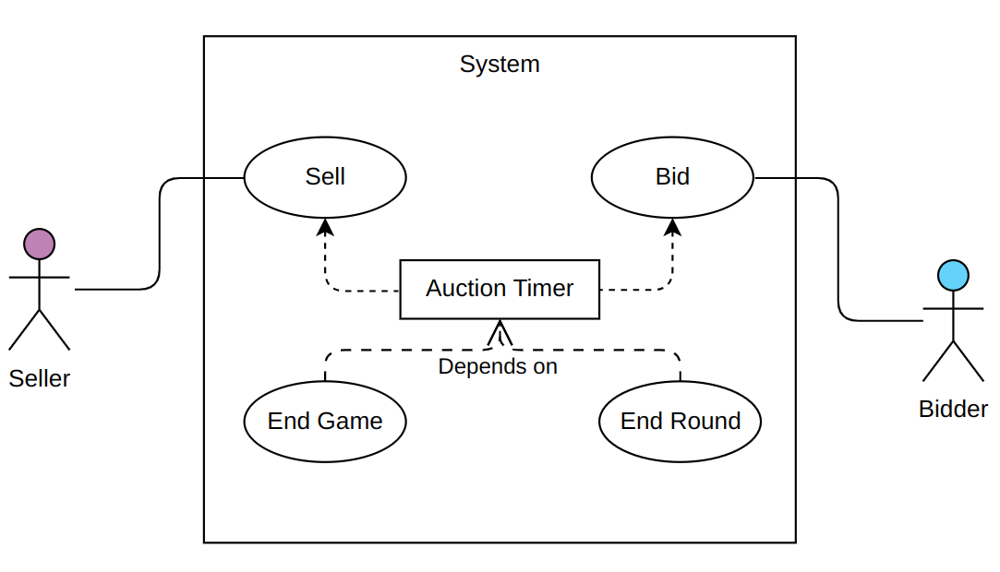
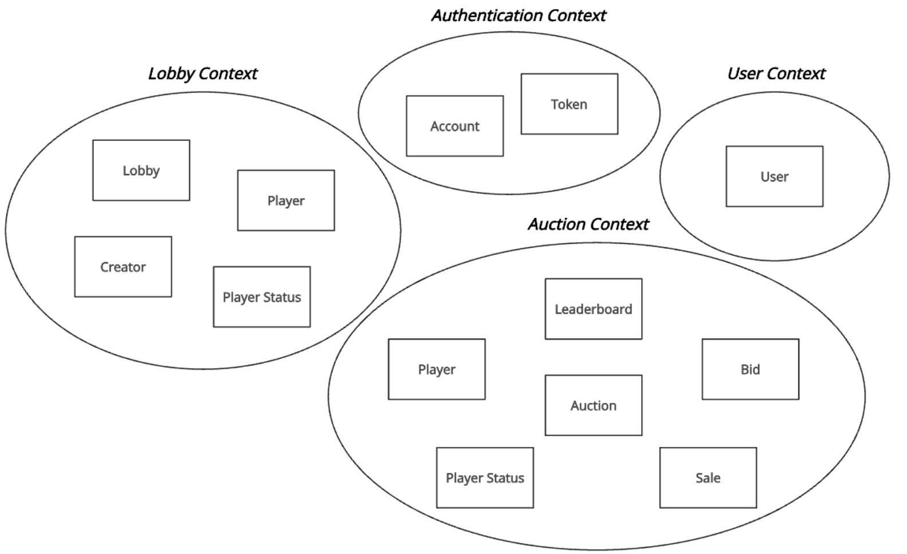
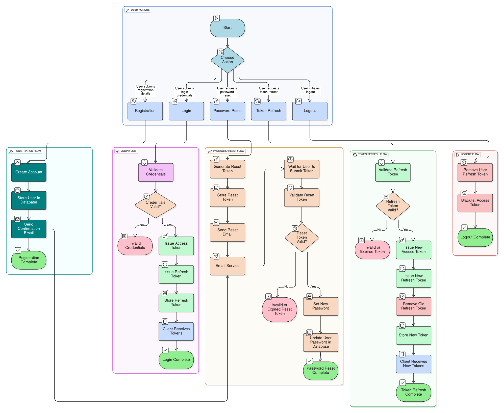
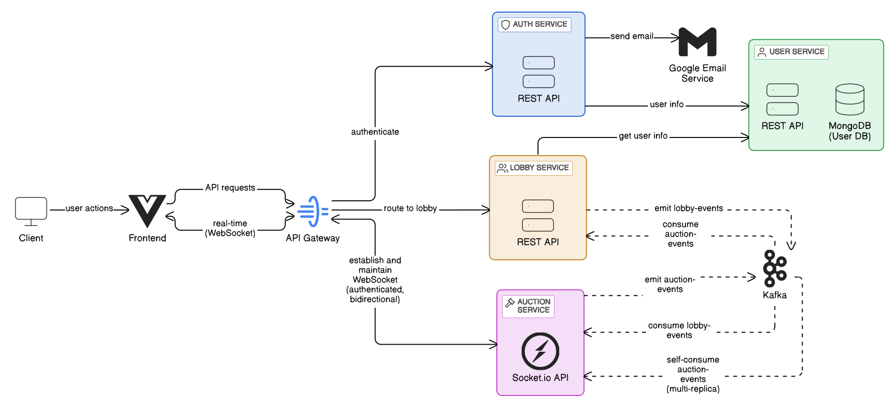
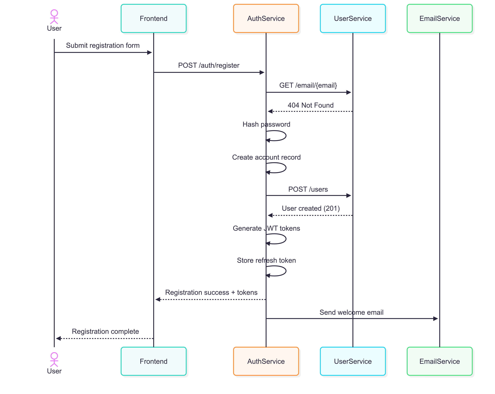
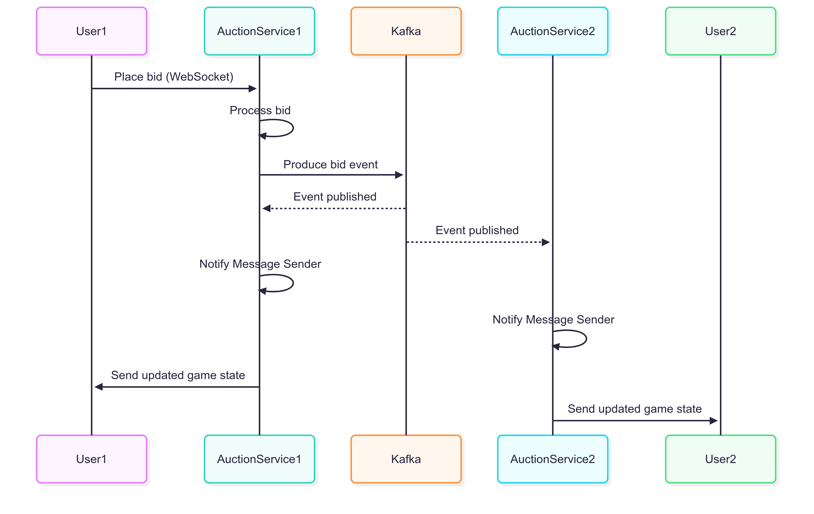
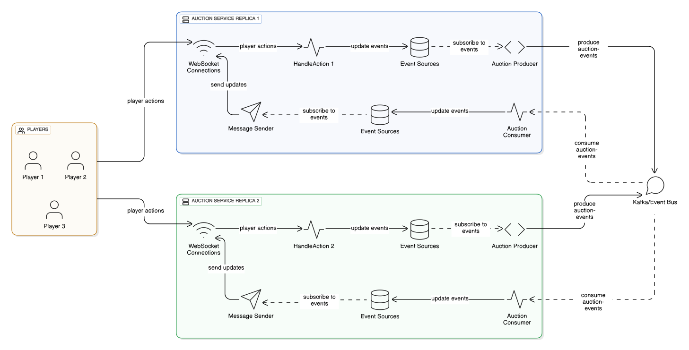
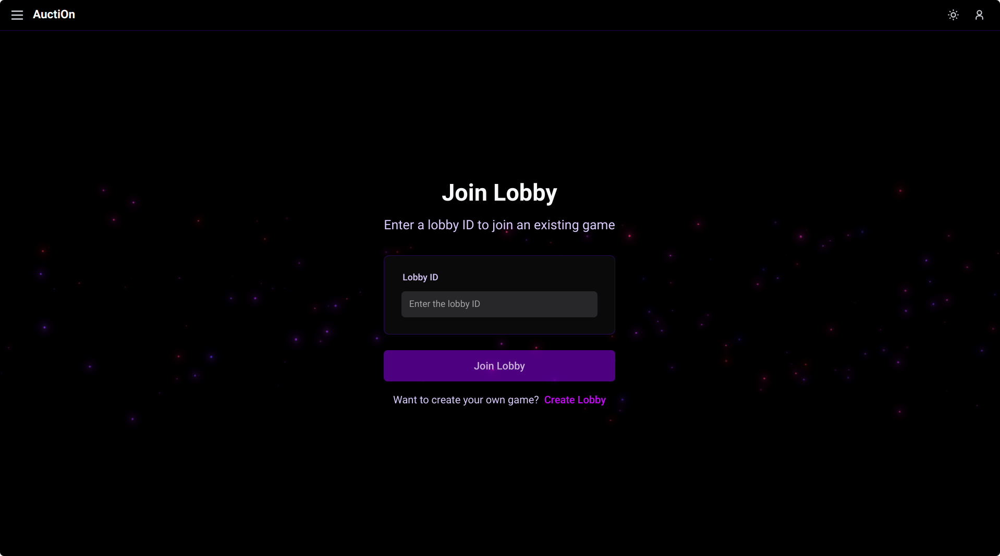
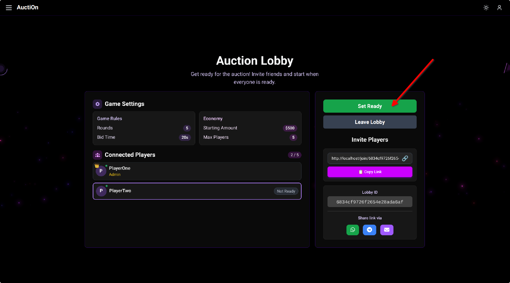
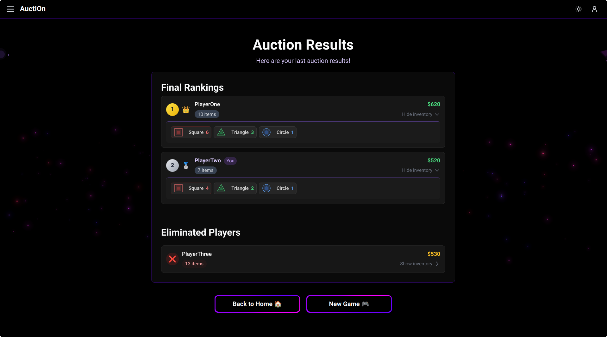

# Project Report

**Marco Frattarola**

---

# Abstract

**AuctiOn** is a real-time, multiplayer online platform designed for strategic auction-based gameplay.
Participants engage in competitive sessions initiated within game lobbies.

Each player begins with an initial allocation of virtual items and currency.
The game proceeds through timed rounds where one designated player acts as the **seller**,
offering items for auction.
Concurrently, other players submit bids within the specified time limit.
The highest bidder acquires the auctioned items, transferring the bid amount to the seller.
The system accommodates players rejoining sessions after disconnection.

The primary goal is to maximize accumulated currency by the game's conclusion.
Success requires effective management of resources and strategic bidding.

---

# Goal & Requirements

The primary goal of the AuctiOn project was to design and implement a real-time,
multiplayer online auction game platform.
The system was developed adhering to specific functional and architectural requirements outlined below.

## Functional Requirements

### User Authentication:

The platform must support user authentication functionalities to
manage player identities.

* Players must be able to register using their email and password.
* Players must be able to log in using their registered email and password.
* Players must be able to log out of the system.
* Players must be able to reset their password using their email.

### Lobby System:

* Players must be able to create new game lobbies.
* Lobbies must be joinable by other players, potentially via a unique link or code.
* Players can set ready status to indicate their availability for game initiation.
* The lobby creator controls the initiation of the game session once all players are ready.
* A player can always leave the game, but he will not be able to rejoin if the game is in progress.
* The lobby creator can always kick a player from the game.


### Gameplay:

The core gameplay loop involves turn-based auctions where players act as **sellers** and **bidders**,
aiming to maximize their virtual currency according to the defined
[Game Rules](https://marcofratta.github.io/AuctiOn/game-rules.html).

* A seller should be able to sell items.
* A bidder should be able to bid on items.
* Each round is time-limited, and players must bid within the specified time.
* If the auction timer expires, the game should automatically proceed to the next round.
* If the maximum number of rounds is reached, the game should conclude.
* On each valid bid, the timer should reset to the default value.



### Disconnection Handling:

* Players must be able to disconnect and subsequently reconnect to an ongoing game.
* If a player disconnects, the game should proceed.
* If a player disconnects, and he is the next seller, his selling turn should be skipped.

### Leave and Kick Handling:

* If the seller leaves the game or is kicked, his turn will be skipped.
* If the lobby creator leaves the game before selling any item,
  the game will be deleted and all players will be kicked.

> **Q: What happens to the seller queue when a player leaves the game?**
>
> A: When a player leaves the game, they are completely removed from the seller queue.
> This ensures that the game flow remains uninterrupted, with the next available player taking the selling role.

### Game Conclusion:

* Upon completion of the game (e.g., after a set number of rounds),
  a leaderboard displaying player rankings must be presented.

## Architectural & Technical Requirements

* **Microservices Architecture:** The system must be implemented using a microservices-based architecture
  to ensure modularity, scalability, and independent deployability of components.
* **Technology Stack:** The project must primarily utilize the **MEVN** stack (MongoDB, Express.js, Vue.js, Node.js),
* supplemented by technologies appropriate for real-time communication (Socket.IO)
  and inter-service communication (Kafka).

## Optional Requirements

* **Player Statistics:** Implement a dedicated section for each player displaying historical game data and
  performance statistics.

## Scenarios

The users can interact with the system through a web interface. These are the main expected scenarios:

* **User Authentication:**
    1. **Registration:** A new user navigates to the registration page, provides their email address and a chosen
       password, and submits the form.
       The system validates the input and creates a new user account.
    2. **Login:** A registered user goes to the login page, enters their email and password, and submits the form.
       The system verifies the credentials and, upon success, grants the user access to the platform.
    3. **Password Reset:** If a user forgets their password, they can initiate a password reset process.
       They enter their registered email address on the password reset page.
       The system sends a password reset link or code to their email.
       The user follows the instructions in the email to set a new password.
    4. **Logout:** An authenticated user can choose to log out.
       The system terminates their session, requiring them to log in again for future access.


* **Lobby Scenario:**
    1. **Lobby Creation/Joining:** A player either creates a new game lobby or joins an existing one (e.g., using a
       unique ID).
    2. **Waiting Room:** Players gather in the lobby.
       They can see other joined players and notify their readiness to start.
    3. **Game Start:** Once all desired players have joined and marked themselves as ready,
       the lobby creator can initiate the game session.

> **Q: What happens if a player leaves as ready and rejoins the lobby?**
>
> A: If a player leaves the lobby while marked as ready and then rejoins,
> they will be automatically set to not ready.
> They must indicate again their readiness for the game.


* **Gameplay Scenario:**
    1. **Seller Turn:** The designated seller for the current round chooses any number of items from his inventory
       to put up for auction.
    2. **Bidding Phase:** Other players act as bidders, placing bids within a time limit.
       The bidders do not know which items are being auctioned, but they can see some aggregated information about the
       items.
       Each valid bid resets the timer.
    3. **Round End:** The auction ends when the timer runs out or a player wins the bid.
       The highest bidder pays the seller, and the items are transferred to the bidder.
    4. **Next Turn:** The role of the seller rotates, according to the predefined order (handling skips for
       disconnected/left players).
    5. **Game Conclusion:** The game continues for a set number of rounds.
       Upon completion, the final scores are calculated, and a leaderboard is displayed showing player rankings.

> **Q: How is the seller rotation determined?**
>
> A: The seller rotation follows a random order established at the beginning of the game.
> If a player disconnects, their turn will be skipped, and the next player in line becomes the seller.
> The order is maintained throughout the game.

> **Q: What information do bidders see about the auctioned items?**
>
> A: Bidders only see the total weight of the batch being auctioned, not the specific items or their quantities.
> This limited information is a core gameplay mechanic that encourages strategic bidding and bluffing.

> **Q: What happens if no one bids during a round?**
>
> A: If no player places a bid during a round and the timer expires,
> the items remain with the seller, and the game proceeds to the next seller in the rotation.

## Self-assessment policy

The quality of the project will be assessed based on the following criteria:

- Successful implementation of the core functional requirements.
- Adherence to the architectural and technical requirements.
- Testing and documentation.
- Code quality and test coverage.

---

# Requirements Analysis

## Implicit hypotheses

* Users need to be authenticated to perform any action.
* Any user can join only one game at a time. So if a user is already in a game,
  they cannot join another one until they leave the current game.
* Each account can only be associated with one email address.
* Joining a lobby and connecting to a game are two different actions:
    - Joining a lobby means getting permission to participate in a game without actively playing yet.
    - Connecting means actively participating in the game after joining.

  > To illustrate: Joining a lobby is like acquiring a ticket to a party—you have permission to attend.
  Connecting is like physically entering the party venue. Disconnecting is temporarily stepping outside,
  but you still have your ticket. Leaving the lobby is surrendering your ticket completely,
  which means you can no longer enter the venue at all.

## Non-functional requirements

* The system should be able to scale to accommodate more users and games.
* Handle multiple concurrent users and games.
* Handle real-time updates and notifications.
* Handle network failures and recover gracefully.
* Data consistency and integrity across multiple services.
* Handle user authentication and authorization securely.
* The Auction timer should be consistent across all players.

## Glossary

* **Seller**: The player who is currently selling items during an auction round. Each auction has one seller who
  presents items for bidding.

* **Buyer**: Any player participating in an auction who can place bids on the items being sold by the seller.

* **Lobby Admin/Lobby Creator**: These terms are synonymous and refer to the user who created the lobby. The lobby admin
  has special privileges including the ability to kick players from the lobby and delete the entire lobby.

* **Leaving vs Disconnecting**:
    - **Leaving** means permanently exiting the lobby. Once a player leaves, they lose their membership and cannot
      reconnect to that lobby anymore.
    - **Disconnecting** is a temporary separation from the lobby due to network issues or client closure. Disconnected
      players can always reconnect to the lobby as they remain members.

* **Join vs Connect**:
    - **Join** means becoming a member of a lobby, which grants permission to connect to that lobby multiple times.
    - **Connect** means establishing an active real-time connection to a lobby you have already joined.

* **Auction**: A single round of the game where one player acts as the seller, presenting items for sale, while other
  players act as buyers and can place bids on those items.

* **Game**: A complete gaming session consisting of one or more auction turns, where players take turns being the seller
  until the game concludes.

---

# Design Overview

This section presents the logical/abstract contribution of the project,
focusing on the high-level design choices made for the AuctiOn platform.
We consider the system's structure, behavior, and the interactions between its core components,
emphasizing the rationale behind these decisions.

## Domain-Driven Design

The fundamental design of the system was driven by the principles of **Domain-Driven Design (DDD)**,
specifically the concept of **Bounded Contexts**.

**Rationale:**

* **Complexity Management:** Online multiplayer games, even seemingly simple ones like auctions,
  involve distinct areas of concern (e.g., user accounts, lobby management, game state...).
  A monolithic approach could lead to a tightly coupled codebase, making it difficult to understand,
  maintain, and evolve specific functionalities independently.
* **Scalability:** Different parts of the system have varying load requirements.
  For instance, the real-time auction component might experience a significantly higher load during active games
  than the user registration process.
  Microservices allow scaling individual components (e.g., the Game service) independently based on demand,
  optimizing resource utilization.
* **Independent Testability:** Changes to one functional area (e.g., changing the game rules)
  can be developed, tested independently within its corresponding microservice.

**Alternatives Considered:**

A traditional **monolithic architecture** was considered initially.
However, given the real-time requirements, the need for clear separation of concerns
(like authentication vs. active game logic), and the desire for independent scalability of the core auction logic,
it was deemed less suitable.

---

# Design: Structure

## Overall Decomposition

The system has been structured according to Domain-Driven Design (DDD) principles,
with each core business capability encapsulated within its own **bounded context**.
This decomposition supports modularity, separation of concerns, and alignment with the problem domain.
The bounded contexts are as follows:

- **Authentication Context**
- **User Management Context**
- **Lobby Management Context**
- **Auction Gameplay Context**



Each bounded context defines its own domain model and ubiquitous language,
and they interact through well-defined contracts.
This design encourages clear domain ownership and simplifies reasoning about each part of
the system independently.

## Bounded Contexts

### Authentication Context

**Purpose:** Responsible for user identification,
credential validation, and authentication workflows.

**Core Domain Concepts:**

- **Account** – Represents a user's credentials and authentication information.
- **Token** – A secure representation of a user's session, used for API access.

Authentication context was modeled to isolate security-sensitive logic.
This ensures a focused and controlled domain that can evolve independently of other aspects of the system,
such as user metadata or gameplay related user information.

### User Management Context

**Purpose:** Handles user-related information such as usernames, emails, and other profile data.

**Core Domain Concepts:**

- **User** – Includes a unique ID, username, email, and domain-relevant metadata.

User profile data often evolves independently.
Decoupling it allows flexibility in modifying profile features without
impacting authentication logic. Future game logic update may need to add some user data
that are independent of the authentication process.

### Lobby Management Context

**Purpose:** Handles all the lobby related functionalities.

**Core Domain Concepts:**

- **Lobby** – A virtual space where players gather before starting a game.
  It holds settings of the game, status, and players.
- **Player** – Represents a user in a particular lobby.
- **Player Status** – Indicates whether a player is ready to start the game or not.
- **Creator** – A designated user with elevated permissions within the lobby.
  He is always the player that created the lobby. He is the one that can start the game.

By isolating the logic and rules around lobbies, such as joining/leaving, ownership,
and kicking users, this bounded context allows for flexible management without polluting gameplay
logic or user identity.
Additionally, defining the Lobby Management Context separates the pre-game logic,
such as handling the ready state or managing lobby joining, from the in-game logic,
ensuring a clear distinction between pre-game and gameplay responsibilities.

### Auction Gameplay Context

**Purpose:** Handles all gameplay logic and state for the auction-based game.

**Core Domain Concepts:**

- **Auction** – Represents a started auction game with its internal state.
- **Player** – Represents a user participating in the auction,
  including their current game state (inventory, money...).
- **Player Status** – Indicates the current connection status of a player in the auction
  (e.g., connected, not-connected).
- **Bid** – An offer made by a player during an auction round.
- **Sale** – A transaction where a player offers any items for bidding.
- **Leaderboard** – The final results of the game, based on their performance in the auction.

Game logic is often complex and performance-sensitive.
Defining a dedicated bounded context allows for optimized modeling of gameplay rules,
event sequencing, and real-time behavior,
independent of user, lobby, or authentication concerns.

## Alternative Designs Considered

- **Unified User Context**: Combining authentication and user profile into a single context was considered,
  but with a view to future expansion of the system, with the addition of a friendship system,
  splitting the two contexts seemed the best choice
- **Unified Game Context**: Initially evaluated whether lobby and auction
  could be combined into one game context. Ultimately rejected in favor of clearer separation of pre-game
  and in-game responsibilities.

---

# Authentication Context

## Overview

The Authentication Context is designed as an independent microservice responsible for user authentication,
credential management, and secure session handling.

## Main Entities

- **Account**: Represents the authentication credentials of a user.
  Stores only the password hash, never the plain password and associates it with a user ID.
    - **Password Hash**: Securely hashed password.
    - **User ID**: Unique identifier for the user in the system.

- **Token**: Represents session and access grants. It can be:
    - **Access Token**: Short-lived token for API authentication.
    - **Refresh Token**: Long-lived token, stored server-side for session renewal and revocation.
    - **Reset Token**: Single-use token for password reset flows.

- **User**: Minimal user information required for authentication (ID).
  Full user profiles are managed in a separate context.


## Components

The Authentication Context is organized into the following components:

- **Controller**: Handles HTTP requests and responses, validates input, and delegates to the service layer.
- **Auth Service**: Encapsulates authentication logic, orchestrates operations across repositories, token management.
- **Repository Layer**
    - **Account Repository**: Stores and retrieves account credentials.
    - **Token Repository**: Persists refresh and reset tokens, including blacklisting for logout or security.

- **Token Generator**: Handles token creation, validation, and expiration for access, refresh, and reset tokens.
- **Mail Service**: Sends registration and password reset emails using a pluggable mail client.


---

## UML Class Diagram


## Alternative Designs Considered

- **Stateless Token Only** Using stateless JWTs without server-side storage was considered,
  but rejected to enable token revocation (logout, password reset) and blacklisting.

---

# User Context

## Overview

The User Context is designed as an independent microservice responsible for
managing user profile data and related operations.
It is designed to provide a clean separation between authentication credentials and user metadata,
supporting flexibility and scalability as the system evolves.

## Main Entities

- **User**: Represents the profile information of a user in the system.
    - **ID**: Unique identifier for the user. It should be used as the source of truth for all
      user-related operations in the system.
    - **Name**: The display name of the user.
    - **Email**: The user's email address (unique).

## Components

The User Context is organized into the following components:

- **Controller**: Handles external requests and responses, validates input, and delegates to the service layer.
- **User Service**: Encapsulates business logic for user management,
  orchestrating operations across repository.
- **User Repository**: Abstracts persistence and retrieval of users from the database.

## UML Class Diagram


---

# Lobby Management Context

## Overview

The Lobby Management Context is designed as an independent microservice responsible for all lobby-related
functionalities. It manages the lifecycle of lobbies, player membership, player status, and the transition from pre-game
to in-game state. A key responsibility is handling users joining and leaving lobbies - with the ability to leave or be
kicked from a lobby even after the game has started. This context is designed to keep pre-game logic separate from
gameplay and user management, supporting scalability and clear domain boundaries.

## Main Entities

- **Lobby**: Represents a virtual room where players gather before starting a game.
    - **ID**: Unique identifier for the lobby.
    - **Creator**: The user who created the lobby and has elevated permissions.
    - **Players**: List of users in the lobby, each with a status.
    - **Status**: Indicates the lobby's state (`waiting`, `in-progress`, `completed`).
    - **Config**: Game settings such as max players, rounds, starting inventory, etc.

- **Player**: Represents a user in a specific lobby, including their status (`ready`, `waiting`).
  

## Components

The Lobby Management Context is organized into the following components:

- **Controller**: Handles externals user messages, validates input, and delegates to the service layer.
- **Lobby Service**: Encapsulates business logic for lobby management, orchestrates operations across repositories, and
  exposes event listeners that external controllers can subscribe to for monitoring lobby state changes (e.g., lobby
  joined, left, created, deleted, started).
- **Repository Layer**:
    - **Lobby Repository**: Persists and retrieves lobby data.
    - **UserLobby Repository**: Tracks user-to-lobby relationships for fast lookup and to store user state in a specific
      lobby.
- **Kafka Producer**: Publishes lobby events to notify other services of lobby state changes.
- **Kafka Consumer**: Consumes auction events to update lobby state based on game progress.


## UML Class Diagram


---

# Auction Gameplay Context

## Overview

The Auction Gameplay Context is design as an independent microservice responsible for all gameplay logic and state for
the auction-based game. It manages the lifecycle of an auction, player actions (such as bidding and selling), and the
real-time progression of the game. This context is designed to be performance-sensitive and to keep gameplay logic
separate from pre-game (lobby) and user management concerns.

## Main Entities

- **Auction**: Represents a running auction game with its internal state.
    - **ID**: Unique identifier for the auction.
    - **Players**: List of users participating in the auction, each with their own state.
    - **Status**: Indicates the auction's state (e.g., `waiting`, `in-progress`, `completed`).
    - **Rounds**: The current round and total number of rounds in the auction.
    - **Items**: The items available for bidding and sale in the auction.
    - **Leaderboard**: The final results of the game, based on player performance.

- **Player**: Represents a user participating in the auction, including their current game state (inventory, money,
  etc.).
- **Bid**: An offer made by a player during an auction round.
- **Sale**: A transaction where a player offers items for bidding.
- **Leaderboard**: The final ranking of players at the end of the auction.

## Components

The Auction Gameplay Context is organized into the following components:

- **Auction**: The main entity representing the auction game. It keeps the internal game state and
  handles all the game logic.
- **Player Channel**: Represent the connection to the player, allowing for real-time communication and updates.
- **Services**:
    - **Auction Service**: Encapsulates business logic for auction management and
      orchestrates operations across repositories. It uses the auction entity to perform auction operations.
    - **Timer Service**: Handles timing for rounds, bidding windows, and auction timeouts,
      ensuring the game progresses in real time.
    - **User Service**: Used to handle information of the players that are in the auctions.
- **Events Sources**: Interfaces that define events that other components can subscribe to.
    - **Player Event Source**: A source of events related to players,
      such as player connection/disconnection and player messages.
    - **Auction Event Source**: A source of events related to auction state changes,
      such as auction start/end, and round transitions.
    - **User Event Source**: A source of events related to user information changes,
      such as user profile updates and user status changes.
    - **Timer Event Source**: A source of events related to timer events,
      such as timer start events.
- **Repository Layer**:
    - **Auction Repository**: Stores and retrieves auction game state.
    - **Player Map Repository**: Stores and retrieves the player-auction mapping for fast lookup.
    - **Timer Repository**: Stores and retrieves timers for each auction.

- **Lobby Consumer**: Consumes lobby events to update auction state based on external triggers.
- **Auction Producer**: Publishes auction events to notify other services of game state changes.
- **Auction Consumer**: Consumes auction events and notify listeners of the corresponding events.
  This class implements all the Event Sources defined before, since it is the source of truth for all the auction
  related events.
- **Message Handler**: Handles incoming external user/game messages, validates input, and delegates to the service
  layer.
- **Message Sender**: Sends messages to players in the auction,
  such as notifications of bids, sales, and auction state changes.


## UML Package Diagram


The **Domain** module contains the core domain entities and logic,
including the Auction, Player, Bid, Sale, and Leaderboard classes.
It is isolated from the rest of the system to ensure a clean separation of concerns.

## Alternative Designs Considered

- **Stateless Auctions**: Using only in-memory auctions was considered,
  but persistent storage was chosen to support scalability.

# Design: Behaviour

This section describes the dynamic behavior of each core microservice in the AuctiOn platform.
For each service, the main entities, their lifecycles, and the rationale behind the chosen state
and activity models are detailed.

## Auction Service: Behaviour

### Overview

The Auction Service orchestrates the real-time auction gameplay,
starting from handling player connections, consuming lobby events,
and managing the full lifecycle of an auction session.
It is responsible for enforcing game rules, coordinating player actions,
and ensuring robust handling of disconnections and edge cases.

### Service Lifecycle

1. **Connection Handling**
    - The service accepts player connections.
    - Each player must be connected to participate in the auction.
    - The service tracks the connection status of each player throughout the game.

2. **Lobby Event Consumption**
    - The Auction Service consumes events from the Lobby Service, such as:
        - `lobby-started`: Triggers the start of the auction game.
        - `lobby-deleted`: Forces the auction to end and disconnects all players.
        - `player-joined`: Updates the player list.
        - `player-left`: Updates the player list and disconnect player.
        - `player-info` Updates player readiness or status.

3. **Auction Start and Player Actions**
    - When the auction starts (on `lobby-started`), the service transitions to the gameplay phase.
      Players can now interact with the auction:
        - **Sell**: Only the current seller (one per round) can offer items for sale.
        - **Bid**: Only non-seller players can place bids, and only if there is an active sale.
    - The service enforces these rules, rejecting invalid actions.

4. **Round and Turn Management**
    - Each round consists of a selling phase (waiting for the seller to offer items) and a bidding phase
      (other players place bids within a time window).
    - When the timer expires or a winning bid is placed, the round ends. The seller role rotates to
      the next player.
    - There is a waiting period between rounds, as the new seller prepares to sell items.
    - After a specified number of rounds, the auction ends.
      All players are automatically disconnected and receive the final results.

### Disconnection Handling

- **Seller Disconnection**: If the current seller disconnects, the game tolerates this and waits
  for the seller to reconnect. All players must wait for the seller to offer items.
  The admin can kick the seller if the wait is excessive, which skips the seller for that round and passes
  the role to the next player (the round does not advance).
- **Next Seller Disconnection**: If a player disconnects before their turn and is the next seller,
  they are automatically skipped if not reconnected by the time their turn arrives.
- **Left Players**: Kicked players or players who left the auction,
  are removed from the game and cannot reconnect. See([Lobby Rules](#lobby-lifecycle))

### Player States

- **Connected**: Player is connected and participating.
- **Disconnected**: Player has lost connection.
- **Selling**: Player is the current seller.
- **Bidding**: Player is bidding in the current round.
- **Kicked/left**: Player has been removed from the game and cannot reconnect.

### State Diagram


Disconnection handling is crucial for the game logic; particularly when the seller leaves the game.
In such cases, other players would wait indefinitely for a sale that will never arrive,
which is why it's important for the admin to always be connected in the lobby.
If the creator is not connected and the seller does not reconnect,
the other players will remain in a waiting state.

To address **stuck** auctions, players can always leave the game entirely (not just disconnect)
and join another lobby. See the section below for more details.

### Stuck Auctions

How can an auction become stuck? This is one possible scenario:

1. The round ends and the next seller is connected.
2. The next seller becomes the actual seller of the new round.
3. The next seller disconnects before placing any item for sale.
4. The lobby creator (admin) disconnects.

Now the auction is **stuck**, since:

- The current seller is disconnected (suppose it will not reconnect).
- The creator is the only one that can kick the seller and make the game progress, but
  the creator is disconnected.

The auction service does not explicitly handle this scenario, as there is no definitive way to
resolve it automatically. The seller may eventually reconnect and resume the game,
just as the lobby creator can reconnect and remove the seller if necessary.
In the meantime, players have the option to either leave the game or wait for the seller/creator to return.
However, to maintain fairness, the system enforces a rule during round transitions:
> If no other players are connected besides the previous seller, the game ends automatically.

This prevents situations where a player could act as the seller in consecutive rounds,
ensuring a balanced gameplay experience even in the face of connectivity issues.

### Notes

- If the lobby creator disconnects, the auction does not end. The auction will be deleted only if the
  creator leaves the auction.
- Knowing the state (connected / not-connected) of the players is crucial
  for the other players. This information will also affect the next-seller selection.

## Lobby Service: Behaviour

### Lobby Lifecycle

The lobby entity transitions through these states:

- Waiting: Lobby created, waiting for players.
- InProgress: The game starts, and the lobby is in-progress.
- Completed: Game ends successfully.

These are the following rules for the lobby lifecycle:

- The lobby is created by the creator.
- Players can join or leave a lobby if it is not full or already in-progress.
- The lobby can be started by the creator if all players are ready.
- The lobby can be deleted by the creator at any time.
- If players leave the lobby and only one player remains (the creator), the lobby is deleted.
- If the lobby is deleted, all players are removed.
- If the game ends successfully, the lobby is marked as completed.

### Player States in Lobby

- Ready: Player is ready to start.
- Not-Ready: Player is not ready.

> The creator does not have a ready state, as they are always ready to start the game.


Stateful lobby management allows for robust handling of player readiness,
joining/leaving, and smooth transition to gameplay.

## Auth Service: Behaviour

### Authentication Workflow

- Registration: User submits credentials, account is created, confirmation email sent.
- Login: Credentials validated, access and refresh tokens issued.
- Token Refresh: Client presents a valid refresh token to obtain a new access token.
  On each refresh, a new refresh token is also issued and the old one is invalidated.
- Logout: All active tokens for the user are blacklisted to prevent further use.
- Password Reset: A short lived reset token is generated and sent to the user's email.
  The user can use this token to securely set a new password.

#### Token Lifecycle and Blacklisting

- **Access Token**: Short-lived, used for authenticating API requests.
  If expired, the client must use a refresh token to obtain a new one.
- **Refresh Token**: Long-lived, used to obtain new access tokens.
  On each refresh, a new refresh token is issued, and the previous one is invalidated (**rotated**).
  This reduces the risk of token theft and replay attacks.
- **Reset Token**: Single-use, time-limited token sent to the user's email for password reset.
  It allows the user to securely set a new password without exposing credentials.
- **Blacklisting**: When a user logs out or a refresh token is rotated,
  the old tokens are added to a blacklist. This ensures that even if a token is stolen,
  it cannot be used after logout or after a refresh, providing robust session invalidation and security.



Token state management ensures security,
support for revocation, and robust session handling.
Token rotation and blacklisting provide strong guarantees against replay and session hijacking.
The reset token mechanism enables secure password recovery without exposing sensitive data.

## User Service: Behaviour

### User Profile Workflow

- Create: New user profile is created.
- Update: Profile data is updated.
- Fetch: Profile data is retrieved.

The user entity is mostly stateless, with operations corresponding to CRUD actions.
These operations are meant to be called only by other services, not directly by the client.

A simple workflow is enough for user profile management, as the Auth Service  
handles all sensitive authentication logic.
Future updates may include more complex user-related features,
like friendships or profile pictures.

---

# Design: Interaction

This section details how the various services in the microservice architecture
interact with each other to enable the auction game functionality.

## Communication Patterns

The system employs three primary communication patterns, each selected for specific interaction requirements:

1. **REST APIs**: Used for synchronous request-response communications between services
2. **Event-Driven Communication**: Implemented with Kafka for asynchronous service-to-service communication
3. **WebSockets**: Employed for real-time bidirectional communication between clients and the auction service

## Service Interaction Model



The system uses an **API Gateway** to manage incoming requests and route them to the appropriate service.
It also handles authentication, ensuring that only valid requests reach the services.
The details of the interactions between the services are outlined below.

### Authentication Service Interactions

The Authentication Service functions as the entry point for user authentication and primarily interacts with:

- **User Service**: Via REST API calls to:
    - Validate user existence
    - Retrieve user information (UID, email)
    - Verify user credentials during authentication operations
- **External Email Service**:
    - Sends emails during registration
    - Sends password reset emails



### Lobby Service Interactions

The Lobby Service manages pre-game operations and communicates through:

- **Event Production**: Emits `lobby-events` to Kafka when:
    - A new lobby is created
    - A player joins a lobby
    - A player leaves a lobby
    - A player changes status (e.g., ready, not ready)
    - A game is started by the lobby creator
    - A game is deleted

- **Event Consumption**: Consume `auction-events` to:
    - Mark lobbies as completed when an auction game ends
    - Release players to join other lobbies

### Auction Service Interactions

The Auction Service handles all in-game logic and interacts through:

- **Event Consumption**:
    - Processes `lobby-events` to:
        - Register new lobbies for accepting connections
        - Track player joins/leaves from lobbies
        - Initialize auction games when lobbies start
    - Process `auction-events` to:
        - Notify the connected players of game state changes via WebSocket (See below)

- **Event Production**: Emits `auction-events` when:
    - An auction game is completed
    - Game state changes that affect lobby status
    - Player actions (e.g., bids, sales) occur

- **WebSocket Connections**: Maintains direct real-time connections with clients for:
    - Receiving player actions
    - Broadcasting auction updates
    - Managing player connection status



Why does the auction service both produce and consume `auction-events`?

The auction service is designed for scalability through replication.
Each instance manages connections for a **subset** of players, meaning players in the same auction
may connect to different instances. To ensure all players receive relevant updates,
each instance produces `auction-events` for its connected players and consumes events
from other instances (including itself).



There is no direct link between the system services and the **Message Sender** component.
The **Auction Consumer** component aggregates all `auction-events` and serves as
the primary source of truth for the **Message Sender** component.
It implements all the Event Sources Interfaces.

```typescript
class AuctionConsumer
  implements AuctionEventsSource,
    UserEventSource,
    TimerEventSource,
    PlayerEventSource
```

The **Message Sender** relies on the **Auction Consumer** to broadcast relevant
events to connected players.

```typescript
class MessageSender {
  constructor(
    auctionEventsSource: AuctionEventsSource,
    playerEventSource: PlayerEventSource,
    userEventSource: UserEventSource,
    timerEventSource: TimerEventSource
  )
}

...
```

Connecting the message sender with the Auction Consumer, enables the support for multiple instances.
Otherwise, making the **MessageSender** subscribe to the actual services that generate the
events (AuctionService, UserService ...), will only work with a single instance.
Each instance of the Auction Service will consume all the events from the auction-event topic.
While this is needed to ensure that all players receive the auction updates,
there is no need that each replica consumes event from the `lobby events` topic.
All the **Lobby Consumer** of the instances are part of the same consumer group,
ensuring that a single event is processed by a single instance of the service.
The consistency of the game state is maintained by using the **same repository** for all instances.
This architecture supports horizontal scaling while maintaining consistency across instances.
The approach to managing game state across instances and avoiding inconsistencies is detailed [here](../implementation).

## Event System

The event-driven communication between the Lobby Service and Auction Service is crucial
for maintaining system state consistency while preserving service independence.
The following table outlines the events produced by the two services:

### Lobby Events

| Event Type    | Producer      | Consumer        | Purpose                                                |
|---------------|---------------|-----------------|--------------------------------------------------------|
| lobby-created | Lobby Service | Auction Service | Notifies when a new lobby is available for connections |
| lobby-joined  | Lobby Service | Auction Service | Updates which players belong to a lobby                |
| lobby-left    | Lobby Service | Auction Service | Updates when a player leaves a lobby                   |
| lobby-started | Lobby Service | Auction Service | Triggers the initialization of an auction game         |
| lobby-deleted | Lobby Service | Auction Service | Notifies when a lobby is deleted                       |
| player-status | Lobby Service | Auction Service | Updates the ready status of a player in the lobby      |

### Auction Events

| Event Type          | Producer        | Consumer      | Purpose                                                    |
|---------------------|-----------------|---------------|------------------------------------------------------------|
| player-connected    | Auction Service | Lobby Service | Notifies when a player connects to an auction game         |
| player-disconnected | Auction Service | Lobby Service | Notifies when a player disconnects from an auction game    |
| player-update       | Auction Service | Lobby Service | Updates player information during the auction              |
| timer-start         | Auction Service | Lobby Service | Notifies when a bidding timer starts                       |
| end-round           | Auction Service | Lobby Service | Signals the end of a bidding round                         |
| end-auction         | Auction Service | Lobby Service | Signals game completion so lobby can be marked as finished |
| sale                | Auction Service | Lobby Service | Notifies when a player puts items up for sale              |
| bid                 | Auction Service | Lobby Service | Notifies when a player places a bid                        |

All the events structures are defined in a **shared kernel** module, named `Common`.
The event-driven architecture allows for loose coupling between services,
enabling them to evolve independently while still maintaining a consistent state across the system.
Future implementations may include a _statistics-service_ that consumes auction events to track player performance
and game statistics.

## Message System

The system implements a real-time message system for bidirectional
communication between the frontend clients and the auction service.
This communication is essential for delivering time-sensitive auction updates and receiving player actions.

### WebSocket Communication

WebSockets are used to establish persistent connections between clients and the server, allowing for:

1. **Bidirectional Communication**: Enables both server-to-client (auction updates) and
   client-to-server (player bids) messages
2. **Low Latency**: Minimizes delay in auction updates, critical for competitive bidding
3. **Connection State Awareness**: Allows the system to track which players are actively connected

The API Gateway proxies WebSocket connections from clients to the Auction Service,
maintaining authentication context while providing a single entry point for all client communications.

### Message Types

The system defines a comprehensive set of message types to handle various aspects of the auction.
All messages follow an event-like schema with a `type` field that enables easy message type
detection and routing:

| Message Type        | Direction       | Purpose                                        |
|---------------------|-----------------|------------------------------------------------|
| player-connected    | Server → Client | Notifies when a player connects to the auction |
| player-disconnected | Server → Client | Notifies when a player disconnects             |
| player-join         | Server → Client | Announces a new player joining the auction     |
| player-leave        | Server → Client | Announces a player leaving the auction         |
| new-bid             | Server → Client | Broadcasts when a new bid is placed            |
| new-sale            | Server → Client | Broadcasts when a new item is put up for sale  |
| auction-start       | Server → Client | Signals the start of an auction                |
| auction-end         | Server → Client | Signals the end of an auction                  |
| round-end           | Server → Client | Signals the end of a bidding round             |
| timer-start         | Server → Client | Notifies when a bidding timer starts           |
| bid                 | Client → Server | Sent when a player places a bid                |
| sell                | Client → Server | Sent when a player puts items up for sale      |
| time-sync           | Client → Server | Used to synchronize client and server time     |

The event-like schema approach provides several benefits:

1. **Type Safety**: Using Zod for schema validation ensures type safety across the system
2. **Consistent Structure**: All messages follow a predictable pattern with a `type` discriminator
3. **Easy Routing**: The message type can be used to route messages to appropriate handlers

### State Reconstruction for Reconnecting Players

A critical feature of the message system is its ability to handle player reconnections gracefully.
When a player reconnects to an ongoing auction, the system must reconstruct the current auction state
for them.

This is accomplished through the `old` field present in several message types:

The `old` field serves as a marker to distinguish between:

- **State Reconstruction Messages** (`old: true`): These messages are sent only to a reconnecting player
  to rebuild their view of the current auction state.
  They represent historical events that occurred while the player was disconnected.
- **Real-Time Updates** (`old: false`): These are new events occurring in real-time that should be
  processed as normal updates.

When a player reconnects, the `MessageSender` component:

1. Sends the current auction state with `old: true`
2. Sends information about all connected players with `old: true`
3. Begins sending real-time updates with `old: false`

This approach ensures that reconnecting players can seamlessly rejoin ongoing auctions
without missing critical information, while also avoiding confusion between historical and current events.

## Design Rationale

The interaction design delivers several key benefits:

1. **Service Autonomy**: Each service maintains ownership of its domain and can evolve
   independently without tight coupling

2. **Communication Pattern Appropriateness**:
    - REST APIs for user data retrieval where immediate responses are needed
    - Event-driven for cross-service state changes to support eventual consistency
    - WebSockets for real-time game interactions to support bidirectional communication

3. **Scalability**: The event-driven architecture allows independent scaling of
   services according to load patterns

4. **Resilience**: Services can continue functioning when other services are temporarily unavailable,
   with event processing resuming when connections are restored

### Alternative Approaches Considered

1. **Direct Service-to-Service REST Calls**: We considered having the Auction Service directly call the Lobby Service
   API to update lobby status. This approach was rejected because:
    - It would create tighter coupling between services
    - It would introduce synchronous dependencies that reduce system resilience
    - It would make the system less tolerant to partial failures

2. **Shared Database**: Using a shared database between Lobby and Auction services was initially considered but rejected
   due to:
    - Violation of service boundaries and domain isolation
    - Reduced autonomy for schema evolution
    - Potential performance bottlenecks

## Possible Improvements

### Connection Service Extraction

The current architecture has the Auction Service performing dual responsibilities:

- **Managing game logic**
- **Handling player connections**.

This leads to the somewhat inefficient pattern where the service both produces and consumes
its own `auction-events` to ensure all connected players receive updates.

A more elegant solution would be to extract the connection management
into a dedicated **Connection Service** that would:

1. Maintain all WebSocket connections with players
2. Consume `auction-events` directly from Kafka
3. Route relevant updates to the appropriate connected players

This separation of concerns would offer several benefits:

- **Simplified Auction Service**: The Auction Service could focus solely on game
  logic without managing connections
- **Eliminated Self-Consumption**: Auction Service instances would no longer need to consume their own events
- **Improved Scalability**: Connection management could scale independently from game logic processing
- **Enhanced Maintainability**: Clearer boundaries between connection handling and business logic

While this approach would introduce additional architectural complexity,
it would result in a more maintainable system with better separation of concerns and reduced message overhead.

# Implementation Details

## Redis Locks

The auction service implements a **robust concurrency control mechanism** to
maintain **data consistency** across both single-replica and multi-replica deployments.
This approach is critical for auction integrity where race conditions could lead to invalid game states.

### The Concurrency Challenge

The auction service faces two primary concurrency challenges:

1. **Single-Replica Concurrency**: Within a single service instance,
   asynchronous operations can lead to **race conditions** when multiple functions attempt to
   read and modify the same Redis resources concurrently.

2. **Multi-Replica Concurrency**: When the auction service is **horizontally scaled**, multiple
   replicas may simultaneously attempt to modify the same auction state,
   potentially overwriting each other's changes.

### Concurrency in JavaScript's Single-Threaded Environment

Despite JavaScript's event loop being single-threaded, concurrency issues still arise due
to the **asynchronous nature** of I/O operations. Consider this diagram illustrating how race conditions
can occur even in a single-threaded environment:


In this scenario, the higher bid (150) is overwritten by the lower bid (120) due to the interleaving
of asynchronous operations, leading to an **inconsistent state**.

### Evolution of the Locking Mechanism

#### Initial Approach: AsyncLock for Single Instance

Initially, the auction service used the [async-lock](https://www.npmjs.com/package/async-lock)
library to provide **in-memory locking** within a single service instance:

```typescript
private
asyncLock: AsyncLock

constructor()
{
  this.asyncLock = new AsyncLock()
}

async
withLock<T>(key
:
string, task
:
() => Promise<T>
):
Promise < T > {
  return this.asyncLock.acquire(key, async () => {
    return await task()
  })
}
```

This approach worked well for a single service instance by:

1. **Queuing concurrent operations** on the same resource, ensuring they're processed sequentially
2. Preventing race conditions within the single instance's event loop
3. Providing a clean abstraction for executing code within a **critical section**

However, as the system evolved to support horizontal scaling with multiple service instances,
this approach became insufficient as it couldn't prevent concurrent modifications from
different service instances.

#### Current Approach: Redis-based Distributed Locking

To address the limitations of the in-memory locking approach, the system now uses **Redis**
to implement **distributed locks** based on the
[Redis Lock algorithm](https://redis.io/glossary/redis-lock/) algorithm:

```typescript
async
runWithLock<T>(
  lockKey
:
string,
  ttlMs
:
number,
  task
:
() => Promise<T>,
  retryDelayMs = 100
):
Promise < T > {
  const lockId = await this.acquireLock(lockKey, ttlMs, retryDelayMs)
  if(!
lockId
)
{
  throw new Error(`Failed to acquire distributed lock for ${lockKey}`)
}
try {
  return await task()
} finally {
  await this.releaseLock(lockKey, lockId)
}
}
```

The Redis lock ensures:

1. Only **one execution context** (whether in the same instance or across different instances) can modify a
   specific auction at a time
2. The lock has a **TTL (Time-To-Live)** to prevent deadlocks if a service instance crashes
3. Each lock is identified by a **unique ID** to prevent accidental releases by other processes

#### Lock Acquisition and Retry Mechanism

The lock acquisition process is a critical component of the distributed locking system.
The `acquireLock` method implements an **atomic lock acquisition** with a retry mechanism:

```typescript
private async
acquireLock(
  lockKey
:
string,
  ttlMs
:
number,
  retryDelayMs
:
number
):
Promise < string | null > {
  const lockId = randomUUID()
  while(true
)
{
  const success = await this.redis.set(lockKey, lockId, 'PX', ttlMs, 'NX')
  if (success) return lockId

  await new Promise(resolve => setTimeout(resolve, retryDelayMs))
}
}
```

This implementation has several important characteristics:

1. **Unique Lock Identifier**: Each lock attempt generates a unique UUID,
   ensuring that only the process that acquired the lock can release it.

2. **Atomic Acquisition**: The Redis `SET` command with `NX` (not exists) and `PX` (expiry in milliseconds)
   options ensures the lock is acquired atomically. This operation either:
    - Creates the key with the lock ID if the key doesn't exist and returns success
    - Returns failure if the key already exists (meaning the lock is held by another process)

3. **Automatic Expiry**: The lock automatically expires after the specified TTL,
   preventing deadlocks if a service crashes while holding a lock.

4. **Retry Mechanism**: If the lock acquisition fails, the process waits for a specified
   delay and then retries. This continues until the lock is acquired or the operation times out.

This approach works effectively for both single-instance and multi-instance scenarios because:

- In a **single-instance environment**, even though JavaScript is single-threaded,
  the event loop can interleave asynchronous operations.
  The Redis lock ensures that when one operation is working with an auction's data,
  other operations must wait until the lock is released, preventing race conditions within the same instance.
- In a **multi-instance environment**, the distributed nature of Redis locks ensures that only
  one service instance can acquire the lock for a specific auction at a time,
  preventing concurrent modifications across different instances.

### Ensuring Atomic Operations with Redis Locks

To maintain data consistency in a distributed system, operations on auction state must be **atomic**.
This means the entire sequence of read-update-write operations must be executed as a single,
indivisible unit to prevent race conditions and data corruption.

The auction service implements a higher-level abstraction called `withAuctionLock` that encapsulates
this atomic operation pattern:

```typescript
private async
withAuctionLock<T>(
  auctionId
:
string,
  operationName
:
string,
  operation
:
(auction: Auction) => Promise<T>
):
Promise < T > {
  const lockKey = `${this.LOCK_PREFIX}${auctionId}`
  return await this.redlock.runWithLock(
    lockKey,
    this.LOCK_TTL,
    async () => {
      try {
        // READ: Get the current auction state
        const auction = await this.findAuctionById(auctionId)

        // UPDATE: Apply business logic changes to the auction
        const result = await operation(auction)

        // WRITE: Save the updated auction state
        await this.saveAuction(auction)

        return result
      } catch (err) {
        logger.error(`[${operationName}] Failed:`, err)
        throw err
      }
    },
    50
  )
}
```

This pattern ensures that:

1. The auction data is read **only after acquiring the lock**
2. Business logic is applied to the in-memory representation
3. The updated state is written back to the database
4. The lock is released only after the write operation completes

To ensure the lock release itself is atomic, the system uses a **Lua script** executed by Redis:

```typescript
private async
releaseLock(lockKey
:
string, lockId
:
string
):
Promise < void > {
  const luaScript = `
    if redis.call("GET", KEYS[1]) == ARGV[1]
    then
      return redis.call("DEL", KEYS[1])
    else
      return 0
    end
  `
  await this.redis.eval(luaScript, 1, lockKey, lockId)
}
```

This script ensures that a lock is only released by the same process that acquired it,
preventing accidental lock releases by other processes.

#### Practical Examples of Atomic Operations

The atomic operation pattern is applied to all critical state-changing operations in the auction service.
Here are some examples:

**Example: Processing a Bid**

```typescript
async
playerBid(bid
:
Bid
):
Promise < AuctionInfo > {
  // Does not require a lock
  const playerAuctionId = await this.findPlayerAuction(bid.playerId)
  if(!
playerAuctionId
)
{
  throw new Error(`Player ${bid.playerId} not found in any active auction.`)
}

return await this.withAuctionLock(playerAuctionId, 'playerBid', async auction => {
  // Using the auction read from Redis
  // Business logic validation
  // [...]
  // Update the auction state
  auction.bid(bid)

  // Return the updated state (will be saved by withAuctionLock)
  return auction.toInfo()
})
}
```

By using this atomic operation pattern consistently throughout the service,
the system ensures that all state modifications are performed safely,
preventing race conditions and maintaining data consistency across all service replicas.

Note that there is no need to ensure that a **bid** made by a player before another player is processed
in the same order. The important aspect is that the game state remains consistent. For example:

1. Player A bids 100 at t0
2. Player B bids 150 at t1
3. Service processes Player B's bid first, updating the state to 150
4. Player A's bid is rejected as it is lower than the current highest bid

This scenario is acceptable as long as the state is consistent.

### Multi-Replica Scenario

When multiple service replicas are running, the distributed lock becomes even more critical:

```
Time →  | Replica 1 (Bid 150)       | Replica 2 (Bid 120)
--------+---------------------------+---------------------------
t1      | Acquire Redis lock        | Attempt to acquire lock
t2      | Lock acquired             | Waiting (Redis lock taken)
t3      | Read auction state        |
t4      | Process bid (150 > 100)   |
t5      | Update state              |
t6      | Write to Redis            |
t7      | Release lock              |
t8      |                           | Lock acquired
t9      |                           | Read auction state (150)
t10     |                           | Process bid (120 < 150)
t11     |                           | Reject bid (error)
t12     |                           | Release lock
```

By using Redis-based distributed locking, the auction service ensures that all
state-modifying operations are performed atomically, preventing race conditions and
maintaining data consistency across all service replicas while enabling horizontal scaling
for improved performance and reliability.

## Time Synchronization

The auction system relies on accurate timing for critical gameplay features,
particularly for auction countdowns. However, there's an inherent challenge:
client system clocks may differ from the server's clock,
which could lead to inconsistent experiences across different players if not properly addressed.

### The Challenge of Distributed Timing

In a distributed system, time synchronization is a fundamental challenge due to:

1. **Different System Clocks**: Client devices may have system clocks that are ahead or behind the server's clock.
2. **Network Latency**: The time taken for messages to travel between client and server introduces delays.
3. **Auction Timing Requirements**: For auctions to function fairly, all clients need to see the same countdown timers.

Without proper time synchronization, players might experience confusing behavior such as:

- Premature auction endings
- Unexpected rejections of valid bids
- Inconsistent countdown displays across different clients

### Time Offset Calculation

The core concept behind the time synchronization mechanism is calculating and maintaining an
`offset` between the client's local time and the server's time.
This offset can then be applied to any client-side timestamp to derive an approximation of
the current server time.

#### Time Offset Formula

After accounting for network latency, the time offset between server and client is calculated using:

$$\delta = T_{server} - (T_{req} + \frac{T_{resp} - T_{req}}{2})$$

Where:

- $\delta$ is the **time offset** (value to add to client time to get server time)
- $T_{server}$ is the **server timestamp** received in the response
- $T_{req}$ is the **client timestamp** when the request was sent
- $T_{resp}$ is the **client timestamp** when the response was received
- $\frac{T_{resp} - T_{req}}{2}$ estimates the **one-way network latency** (assuming symmetrical network conditions)

This formula can be broken down into these steps:

1. Measure the **round-trip time**: $T_{resp} - T_{req}$
2. Estimate **one-way latency**: $\frac{T_{resp} - T_{req}}{2}$
3. Adjust the request time to account for latency: $T_{req} + \frac{T_{resp} - T_{req}}{2}$
4. Calculate the offset as the difference between server time and adjusted client
   time: $T_{server} - (T_{req} + \frac{T_{resp} - T_{req}}{2})$

#### Key Assumptions

This time synchronization method relies on two critical assumptions:

1. **Negligible Server Processing Time**: The time taken by the server to process the time-sync request and generate the
   response is assumed to be negligible compared to network latency. This means that $T_{server}$ is generated almost
   immediately after the server receives the request.

2. **Symmetrical Network Latency**: The formula assumes that the time taken for a message to travel from client to
   server is approximately equal to the time taken for the response to travel back from server to client:

   $$L_{c \to s} \approx L_{s \to c} \approx \frac{RTT}{2}$$

   This allows us to estimate one-way latency as half of the round-trip time, which may not be precisely true in
   networks with asymmetrical upload and download speeds or routing differences.

While these assumptions may introduce small inaccuracies, the periodic re-synchronization helps mitigate any accumulated
errors, making the approach robust enough for auction timing purposes. In practice, the slight imprecision is acceptable
for maintaining consistent game timing across clients.

Once calculated, any client timestamp can be converted to server time by adding this offset:

$$T_{synchronized} = T_{current} + \delta$$

The implementation uses this formula to maintain **clock synchronization** between all clients and the server, ensuring
that auction timers and other time-sensitive features work correctly regardless of differences in client system clocks.

### Socket.IO Acknowledgment Mechanism

The time synchronization implementation leverages Socket.IO's **acknowledgment mechanism**, which is a powerful feature
for **request-response style communication** patterns. When emitting an event with Socket.IO, you can pass a **callback
function** as the last parameter:

```typescript
socket.emit('time-sync', {}, (response) => {
  // This function executes when the server acknowledges the event
  console.log(response);
});
```

This callback function is executed when the server **explicitly acknowledges** the event by calling the acknowledgment
function on its side:

```typescript
// Server-side handler
socket.on('time-sync', (data, ack) => {
  // Process the request
  const serverTime = Date.now();

  // Send acknowledgment with response data
  ack({ serverTime });
});
```

This mechanism is ideal for time synchronization because:

1. **Request-Response Pattern**: It enables a clean request-response pattern without requiring separate event handlers
   for requests and responses.
2. **Guaranteed Pairing**: Each acknowledgment callback is **tied to its specific emission**, eliminating the need to
   correlate requests and responses manually.
3. **Timing Accuracy**: The client can measure the **exact round-trip time** by recording timestamps before emission and
   after acknowledgment.

The acknowledgment is not just a confirmation that the event was received but also a **channel to return data** from the
server to the client in response to the event, making it perfect for the time synchronization process where the server
needs to communicate its current time back to the requesting client.

### Time Synchronization Implementation

The system addresses this challenge through a client-server time synchronization mechanism implemented using Socket.IO's
acknowledgment capabilities.

#### Server-Side Implementation

On the server side, the WebSocketAdapter handles time synchronization requests:

```typescript
socket.on('time-sync', (_: unknown, ack?: (response: { serverTime: number }) => void) => {
  const response = { serverTime: Date.now() }
  if (typeof ack === 'function') {
    ack(response)
  }
})
```

When a client sends a 'time-sync' event, the server immediately responds with the current server time using Socket.IO's
acknowledgment mechanism.

#### Client-Side Implementation

The client implements time synchronization through the `syncTime` function:

```typescript
const syncTime = () => {
  if (!socketStore.socket) return
  const requestTime = Date.now()
  socketStore.socket.emit('time-sync', {}, (response: { serverTime: number }) => {
    const responseTime = Date.now()
    const roundTripTime = responseTime - requestTime

    // Estimate one-way latency as half of round trip time
    const latency = Math.floor(roundTripTime / 2)

    // Calculate offset considering the latency
    const serverTime = response.serverTime
    lobbyStore.setTimeOffset(serverTime - (requestTime + latency))
  })
}
```

This implementation:

1. Records the client's timestamp at the moment of sending the request
2. Sends a 'time-sync' event to the server
3. When the server responds:
    - Records the client's timestamp at the moment of receiving the response
    - Calculates the round-trip time (RTT)
    - Estimates one-way latency as half the RTT
    - Calculates the time offset between server and client
    - Stores this offset in the application state

#### Synchronized Time Calculation

Once the time offset is established, the client can calculate the synchronized time at any point:

```typescript
const getSyncedTime = (): number => {
  const currentTime = Date.now()
  return currentTime + lobbyStore.serverTimeOffset
}
```

This function:

1. Gets the current client time
2. Adjusts it by the stored server-client time offset
3. Returns a timestamp that closely approximates the current server time

#### Periodic Synchronization

To account for clock drift and maintain accuracy, the system implements periodic synchronization:

```typescript
const startPeriodicSync = (interval) => {
  syncTime() // Initial sync

  // Set up periodic sync
  syncInterval = setInterval(() => {
    syncTime()
  }, interval)

  // Return cleanup function
  return () => {
    if (syncInterval !== null) {
      clearInterval(syncInterval)
      syncInterval = null
    }
  }
}
```

This approach ensures that:

1. An initial synchronization occurs when the client connects
2. Regular synchronizations maintain accuracy
3. Proper cleanup occurs when the component is unmounted

::: details Example
Consider a scenario with two clients and a server:

- Server time: 10:00:00.000
- Client A time: 10:00:05.000 (5 seconds ahead)
- Client B time: 09:59:55.000 (5 seconds behind)

Without time synchronization, if an auction has 30 seconds remaining:

- Client A would display 25 seconds remaining (and potentially miss the opportunity to bid)
- Client B would display 35 seconds remaining (and might attempt to place bids after the auction has actually closed)
- Server would enforce the correct 30-second window, leading to confusion

With time synchronization:

1. Each client calculates its time offset from the server:
    - Client A: -5000ms offset (client is ahead of server)
    - Client B: +5000ms offset (client is behind server)
2. When displaying the countdown, each client adjusts its local time:
    - Client A: 10:00:05.000 - 5000ms = 10:00:00.000 (synchronized server time)
    - Client B: 09:59:55.000 + 5000ms = 10:00:00.000 (synchronized server time)
3. Both clients now display the correct 30-second countdown based on the server's authoritative time

This ensures all players have the same opportunity to bid within the auction window regardless
of their local system clock settings.
:::

### Benefits of the Implementation

This time synchronization approach provides several key benefits:

1. **Consistent User Experience**: All players see the same auction countdowns.
2. **Fairness**: No player gains an advantage or disadvantage due to their system clock.
3. **Latency Compensation**: The mechanism accounts for network latency in its calculations.
4. **Resilience to Drift**: Periodic synchronization prevents accumulated errors from clock drift.
5. **Lightweight**: The implementation uses minimal bandwidth and processing resources.

By implementing this client-server time synchronization mechanism, the auction system ensures fair and consistent timing
across all connected clients, which is critical for maintaining the integrity of the auction process.

## API Specifications

The following links provide access to the API specifications for the different services that make up the
auction system:

### WebSocket API

- [WebSocket Events API Reference](https://marcofratta.github.io/AuctiOn/api-reference/websocket.html) - Complete
  documentation of all WebSocket
  events.

### Service APIs

- [Auth Service API](https://marcofratta.github.io/AuctiOn/api-reference/auth-api.html) - RESTful API for user
  authentication
  management.
- [Lobby Service API](https://marcofratta.github.io/AuctiOn/api-reference/lobby-api.html) - RESTful API for lobby
  management.
- [User Service API](https://marcofratta.github.io/AuctiOn/api-reference/user-api.html) - API for users profile
  management.

Since all the project packages uses [Zod](https://zod.dev/) for schema validation,
the API specifications are generated from the Zod schemas defined in each service, using
[zod-to-openapi](https://github.com/asteasolutions/zod-to-openapi). This ensures that the API documentation
is always in sync with the actual code and provides a clear contract for each service's API.

# Self-assessment Overview

This section provides an overview of the self-assessment criteria used to evaluate the
AuctiOn platform and its compliance with the requirements.

## Architectural Goals

The platform adheres to microservice principles:

- **Independent Deployment**: Each microservice can be deployed independently
- **Separation of Concerns**: Each microservice has a well-defined responsibility
- **Event-Driven Communication**: Services communicate through Kafka events
- **Real-Time Performance**: WebSocket connections provide real-time updates to users

## Code Quality

The codebase maintains high quality standards:

- **TypeScript**: Strong typing throughout the codebase
- **ESLint**: Consistent code style and best practices
- **Modular Design**: Clear separation of concerns within each service

## Testing Strategy

The AuctiOn platform has been thoroughly tested using various testing methodologies.
For detailed information about the testing approach and results,
please refer to the following sections:

- [Testing Overview](#testing): Overview of the testing strategy and tools
- [Coverage Report](#test-coverage): Detailed test coverage reports for each microservice
- [End-to-End Tests](#e2e-tests): Description of end-to-end test scenarios and implementation

The testing results demonstrate the robustness and reliability of the platform,
with high test coverage across all microservices and successful end-to-end test scenarios.

## Testing

This section provides an overview of the testing strategy and implementation for the AuctiOn platform.

### Testing Strategy

The AuctiOn platform has been thoroughly tested using various testing methodologies:

1. **Unit Tests**: Each microservice has comprehensive unit tests for individual components, including services,
   controllers, and repositories.
2. **Integration Tests**: Tests that verify the interaction between different components within a microservice.
3. **End-to-End Tests**: Tests that verify the entire system's functionality from the user's perspective.

### Test Implementation

For each microservice, a comprehensive test suite has been developed:

- **Unit Tests**: Isolated tests for individual functions, services, and controllers
- **Integration Tests**: Tests that verify the interaction between different components within a microservice

To facilitate testing of external dependencies, the following tools were utilized:

- **TestContainers**: For Kafka testing, providing isolated Kafka instances during test execution
- **IoRedis Mock**: For Redis testing, simulating Redis functionality without requiring a live Redis instance
- **MongoDB Memory Server**: In-memory MongoDB server for database testing without external dependencies

This approach ensures tests can run in isolation without requiring external services to be running, making the test
suite more reliable and faster to execute.

### Test Coverage

The test coverage for each microservice is monitored using Jest's coverage reporting. The coverage reports provide
insights into the code quality and test completeness.

You can view the detailed coverage reports for each microservice in
the [Coverage Report](https://marcofratta.github.io/AuctiOn/report/self-assessment/coverage.html) section.

### Code Quality Tools

To maintain high code quality standards, the following tools were implemented:

- **ESLint**: For static code analysis and identifying problematic patterns
- **Prettier**: For consistent code formatting across the entire codebase

### Continuous Integration Process

A robust CI/CD process was implemented using Git hooks to ensure code quality at every step:

1. **Pre-commit Hooks**:
    - **Conventional Commits**: Validates that commit messages follow the conventional commits format
    - **ESLint**: Runs linting checks on staged files, aborting the commit if issues are found
    - **Prettier**: Automatically formats staged files to ensure consistent code style
    - **Targeted Testing**: Runs tests based on the commit scope

2. **Commit Scope Strategy**:
    - Commit messages include a scope matching the packages in the monorepo
    - Tests are automatically run only for the affected package based on the commit scope
    - This approach ensures faster feedback cycles while maintaining code quality

This comprehensive approach to testing and quality assurance ensures that the AuctiOn platform remains robust,
maintainable, and free of regressions as development progresses.

### Testing Tools

The following tools and libraries were used for testing:

- **Jest**: Primary testing framework for unit and integration tests
- **Supertest**: HTTP assertions for API testing
- **MongoDB Memory Server**: In-memory MongoDB server for testing
- **Redis Memory Server**: In-memory Redis server for testing
- **Cypress**: End-to-end testing framework

## End-to-End Tests

This section describes the end-to-end tests implemented for the AuctiOn platform.

### Overview

End-to-end (E2E) tests verify the entire system's functionality from the user's perspective. These tests simulate real
user interactions with the application and ensure that all microservices work together correctly as an integrated
system.

### Test Architecture

The E2E tests are implemented using a dedicated test package that orchestrates test scenarios across all microservices.
The tests use:

- **Jest**: As the primary testing framework
- **Supertest**: For HTTP API testing
- **Socket.io-client**: For WebSocket communication testing
- **Custom Client Class**: An abstraction layer to simplify test scenario implementation

The tests run in a controlled environment using Docker Compose, which spins up all required services including:

- All microservices
- MongoDB
- Redis
- Kafka
- Mailhog (for email testing)

#### Multiple Auction Service Replicas

A key aspect of the test architecture is the use of multiple replicas of the Auction Service within the Docker Compose
test environment. This design choice serves several important purposes:

1. **Horizontal Scaling Verification**: Tests confirm that the system operates correctly when the Auction Service is
   horizontally scaled
2. **Load Distribution**: Validates that requests are properly distributed across service instances
3. **State Synchronization**: Ensures that all Auction Service instances maintain consistent state through shared Redis
   and Kafka infrastructure
4. **Failover Testing**: Provides confidence that the system can handle instance failures without disrupting user
   experience

This approach ensures that the application behaves correctly in a production-like environment where multiple instances
of services would typically be deployed for redundancy and load balancing.

### Test Scenarios

The following E2E test scenarios have been implemented:

#### User Registration and Authentication Flow

The `RegisterFlow.test.ts` implements a comprehensive user registration and authentication flow:

1. User registration with email and password
2. Login with created credentials
3. Password reset flow (forgot password)
4. Login with new password after reset
5. Validation of token-based authentication

#### Match Simulation

The `MatchSimulation.test.ts` tests a complete auction match with four players:

1. User registration for all players
2. Lobby creation and joining
3. WebSocket connections for real-time communication
4. Player readiness and match start
5. Multiple auction rounds with different sellers
6. Bidding process and winner determination
7. Validation of inventory and money changes
8. Final leaderboard verification

#### Multiple Matches

The `MultipleMatches.test.ts` validates the system's ability to handle multiple concurrent matches:

1. Creation of multiple lobbies
2. User registration and joining for all players
3. Independent match progression
4. Verification of isolated game states
5. Correct completion of all matches

### MailHog Integration

A crucial part of the E2E testing is validating the forgot password flow, which requires testing email delivery. For
this purpose, [MailHog](https://github.com/mailhog/MailHog) is integrated into the testing environment.

#### What is MailHog?

MailHog is an email testing tool that creates a local SMTP server and web UI for testing email sending in development
environments. It captures all outgoing emails without actually delivering them to real recipients.

#### How MailHog is Used in Testing

In the `RegisterFlow.test.ts` file, MailHog is used to:

1. Capture the password reset email sent when a user initiates the forgot password flow
2. Retrieve the email using MailHog's API
3. Extract the password reset token from the email content
4. Use the token to complete the password reset process
5. Verify the user can log in with the new password

This approach allows for complete end-to-end testing of the password reset flow without requiring actual email delivery,
making tests reliable and reproducible.

#### Implementation Details

The test suite includes a custom `retrieveResetTokenForUser` function that:

1. Queries the MailHog API for emails sent to a specific address
2. Parses the email content to extract the reset token
3. Returns the token for use in the password reset API call

### Running E2E Tests

The E2E tests are designed to run in an isolated environment. A custom shell script (`run-tests.sh`) orchestrates the
test execution:

1. Starts all required services using Docker Compose
2. Runs the Jest test suite
3. Tears down all containers and volumes after tests complete

> **Warning:** The E2E test are long-running and can take several minutes to complete.
> This is because each round must wait for the auction timer to expire, simulating real user interactions.

---

# Deployment Instructions

## Prerequisites

- Node.js v18+
- npm v8+
- Docker & Docker Compose v2+
- Git

## Deployment Steps

### 1. Clone Repository

```bash
git clone https://github.com/MarcoFratta/AuctiOn.git
cd AuctiOn
```

### 2. Environment Configuration

Create a `.env` file by renaming the provided template:

```bash
# Rename the template to .env file
cp env.tempalte .env

# Edit the .env file with your own values
nano .env  # or use any text editor
```

For more details on configuring the environment variables,
see the [Environment Configuration Details](#environment-configuration) section below.

### 3. Run

Start all services using Docker:

```bash
npm start
```

### 4. Accessing the Application

- Frontend: http://localhost
- API Gateway: http://localhost:8080

### 5. Stopping the Application

To stop the application, you can use:

```bash
npm stop
```

## Local Development

The first step is to install the necessary dependencies for the project.

```bash
npm install
```

> Be sure to run this command in the root directory of the cloned repository.
> This will install all necessary dependencies for the project.

For local development without Docker, you can run each service individually.
Start each service in development mode from its respective package directory:

```bash
npm run dev -w auth-service
```

When running services individually, make sure that the
necessary services are running and accessible. For example, the `auth-service`
uses **Redis** so make sure to start a `Redis server` before running the service:

```bash
docker run -p 6379:6379 redis
```

> Make sure to expose the ports. By default, the docker-compose file only exposes the frontend ports

### Code Quality Tools

The project is configured with ESLint and Prettier for code quality and formatting.
To ensure your code follows the project's style guidelines:

```bash
# Run ESLint to check for code issues
npm run lint

# Format code using Prettier
npm run prettier
```

#### Husky

The project uses Husky to automatically run linting and formatting checks before commits.
This ensures that all code committed to the repository meets quality standards.

To set up Husky after cloning the repository:

```bash
# Initialize Husky
npm run init
```

Husky will then:

- Run ESLint before commits to catch potential issues
- Run Prettier to ensure consistent code formatting
- Validate commit messages according to conventional commit standards

If a commit fails the quality checks, you'll need to fix the issues
before you can commit your changes.

### Building Documentation

To build the openapi documentation for the API, you can use the following command:

```bash
npm run docs
```

To build and preview the `vitepress` documentation (including this deployment guide):

```bash
# Build the documentation
npm run docs:build -w docs
# Preview the documentation
npm run docs:preview -w docs
```

Documentation will be available at http://localhost:5173.
> Check the output of the command for the exact URL, as it may vary.

### Testing

The project includes comprehensive test suites for each service.
You can run tests for individual services or run all
tests at once.

#### Running All Tests

To run all tests across the project:

```bash
npm test
```

This will execute tests for all services in parallel and display the results.

#### Testing Individual Services

To test a specific service:

```bash
# Test the authentication service
npm run test:auth-service

# Test the user service
npm run test:user-service

# Test the lobby service
npm run test:lobby-service

# Test the auction service
npm run test:auction-service

# Test the API gateway
npm run test:api-gateway
```

#### E2E Tests

The project also includes end-to-end tests that verify the system as a whole:

```bash
npm run test:e2e
```

> Note: Integration tests require Docker to be running as they use containers to set up a
> test environment.

## CI and Deployment

The project includes CI/CD configuration for automatically publishing documentation:

### GitHub Pages Deployment

For GitHub repositories, a GitHub Actions workflow (`.github/workflows/docs.yml`) is configured
to build and deploy the VitePress documentation to GitHub Pages,
following the [official VitePress deployment guide](https://vitepress.dev/guide/deploy).

The documentation will be available at:

- `https://<your-github-username>.github.io/<repository-name>/`.

The coverage and api-specification are automatically generated by two scripts on build.
You can also run them manually using:

```bash
# for the api-specification
npm run docs:generate -w docs
# for the coverage report
npm run generate-coverage -w docs
```

the openapi specification are shown
on `vitepress` using [vitepress-openapi](https://github.com/enzonotario/vitepress-openapi)  :

#### Important Configuration for GitHub Pages

For proper CSS and assets loading on GitHub Pages, you must configure the base path in your VitePress configuration
file:

1. Open `packages/docs/docs/.vitepress/config.mts`
2. Add the `base` property with your repository name:

```js
export default defineConfig({
  // other configurations...
  base: '/<repository-name>/',
  // ...
})
```

For example, this repository is named `AuctiOn`, the base path should be:

```js
base: '/AuctiOn/',
```

This ensures that all assets (CSS, JavaScript, images) load correctly on GitHub Pages.

To enable GitHub Pages:

1. Go to your repository settings
2. Navigate to "Pages"
3. Select "GitHub Actions" as the source (this should be automatic if the workflow has already run)

The workflow will automatically deploy your documentation when changes are pushed
to the `master` branch.

## Environment Configuration

### Email Server Configuration

The authentication service requires email configuration for sending verification emails
and password reset links. An easy way to set this up is by using a _Gmail_ account:

1. Set `AUTH_S_EMAIL_USER` to your Gmail address (e.g., `your.email@gmail.com`)
2. Set `AUTH_S_EMAIL_PASS` to an App Password generated for your Gmail account
   > You can create an App Password by following Google's
   instructions [here](https://support.google.com/accounts/answer/185833?hl=en)

3. Set `AUTH_S_APP_BASE_URL` to the URL where your frontend application is accessible

### JWT Secret Keys

For security, you should set strong, unique secret keys:

- `AUTH_S_ACCESS_SECRET`: Used to sign JWT access tokens
- `AUTH_S_REFRESH_SECRET`: Used to sign JWT refresh tokens

### Service URIs

The default configuration assumes you're running with Docker Compose.
If you're running services individually during development,
you'll need to update the service URIs to use `localhost` with the appropriate ports.

---

# Usage Examples

This section provides a comprehensive guide on how to use the AuctiOn game application,
covering the main workflows from authentication to gameplay.

## Authentication Workflow

The authentication system allows users to register new accounts and log in to existing ones.
All game features require authentication.

### Registration

Users can create a new account by providing an email, username, and password.


### Login

Returning users can log in with their email and password.


## Lobby Management Workflow

After authentication, users can join existing game lobbies or create their own.

### Creating a New Lobby

Users can create a custom game lobby by setting parameters like maximum players,
game duration, etc.


Once created, the lobby `join link` is displayed, which can be shared with other players.


### Joining a Lobby

Users can join an existing lobby if it has available slots.
To join a lobby, a user can either enter the lobby ID or use a
`join link` provided by the lobby creator.



### Set Ready State

Users can indicate they are ready to start the game by clicking the `Set Ready` button in the lobby.



### Kicking Players

The lobby creator can `kick` players from the lobby if needed.


### Start the Game

Once all players are ready, the lobby creator can start the game.


## Auction Game Workflow

Once all players have joined a lobby and the game starts, players participate in the auction gameplay.

### Selling Items

When it's a player's turn to sell, they can select items from their inventory to put up for auction.
They can also see some **statistics** about the items that he is selling, such as the `predicted price` or
the number of items in the player's inventory after selling the selected items.


### Bidding

When it's not a player's turn to sell, they can place bids on items being auctioned by other players.
Be sure to bid before the auction timer runs out!


## Results and Game End

At the end of the game, players can see the final results, including their total coins and inventory.



## Game Rules Reference

For a complete understanding of the game mechanics, please refer to
the [Game Rules](https://marcofratta.github.io/AuctiOn/game-rules.html) section.

---

# Conclusion

## Project Summary

The **AuctiOn** platform represents the implementation of a real-time auction game built on modern,
distributed system principles.

The core achievement of this project has been the creation of a fully functional microservices architecture
that supports real-time bidding and auction mechanics.
The system maintains data consistency even under concurrent operations while providing
responsive gameplay.

Key accomplishments include:

* Implementation of a robust auction game logic with selling and bidding mechanics
* Development of a scalable microservices architecture with clear service boundaries
* Creation of an efficient lobby system for game session management
* Integration of secure JWT-based authentication with refresh token rotation
* Establishment of real-time communication using Socket.IO with time synchronization
* Design of a distributed locking mechanism to ensure data consistency

## Future Work

While the current implementation provides a solid foundation,
several enhancements could further improve the system:

* Adding more complex item types and special auction events to enhance gameplay variety
* Implementing a friend system to allow users to connect and play more easily
* Creating an administrative dashboard for monitoring system health and managing users
* Expanding the test coverage
* Adding statistics and analytics features to track player performance over time

## Lessons Learned

Developing the AuctiOn platform has been an enriching learning experience.
The project helped solidify my understanding of several important concepts:

* The challenges of maintaining data consistency in distributed systems and the importance
  of proper locking mechanisms
* Techniques for handling real-time synchronization across multiple clients (socket.io)
* The event-driven architecture using Kafka for loose coupling between services
* The importance of careful API design and clear documentation for maintainable systems
* The benefits of containerization for consistent development and deployment environments
* The value of comprehensive testing in ensuring system reliability
* TypeScript development best practices, including strong typing, interfaces, generics, and effective error handling
* Modern TypeScript tooling for code quality, including ESLint configurations and Prettier for consistent formatting 