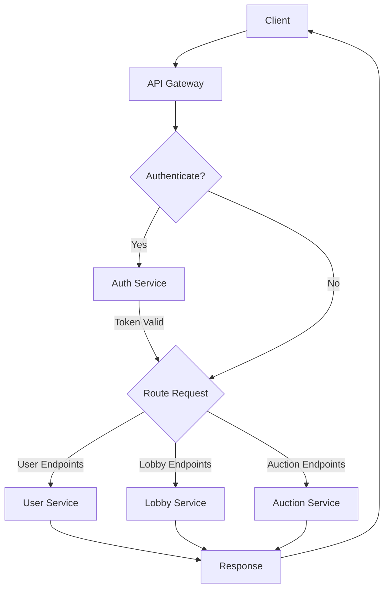

# API Gateway

The API Gateway serves as the entry point for all client requests to the AuctiOn platform.

## Responsibilities

- Route requests to appropriate microservices
- Authenticate incoming requests
- Validate request formats
- Handle cross-cutting concerns
- Provide a unified API interface

## Request Flow



## Authentication Flow

For protected endpoints, the API Gateway:

1. Extracts the JWT token from the request header
2. Forwards the token to the Auth Service for validation
3. If valid, routes the request to the appropriate service
4. If invalid, returns a 401 Unauthorized response

## API Routes

| Route Pattern | Service         |
|---------------|-----------------|
| `/auth/*`     | Auth Service    |
| `/users/*`    | User Service    |
| `/lobbies/*`  | Lobby Service   |
| `/auctions/*` | Auction Service |

## Error Handling

The gateway provides consistent error responses across all services:

```json
{
  "error": true,
  "message": "Description of the error",
  "statusCode": 400,
  "path": "/requested/path"
}
``` 