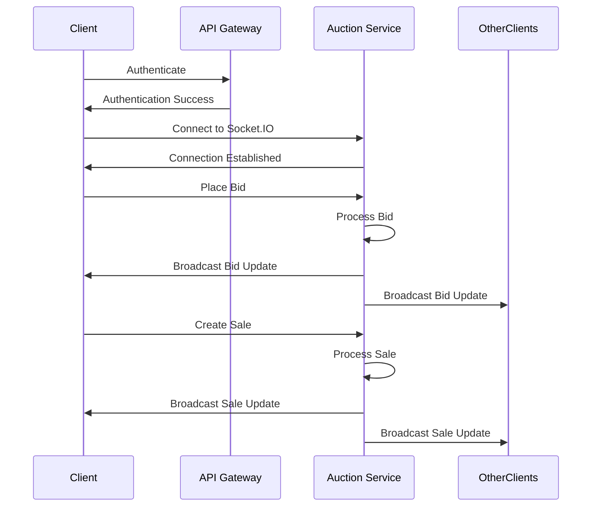

# Auction Service

The Auction Service is the core game engine that powers the real-time auction gameplay.

## Responsibilities

- Manage auction game state
- Process player bids and sales
- Handle real-time game updates via Socket.IO
- Enforce game rules and mechanics
- Calculate game results and leaderboards
- Consume lobby events from Kafka

## Real-time Communication

The Auction Service uses Socket.IO to provide real-time updates to connected clients:

## Event Consumption

The Auction Service consumes the following events from the Lobby Service:

| Event           | Action                             |
|-----------------|------------------------------------|
| `lobby-created` | Initialize auction data structures |
| `lobby-joined`  | Add player to auction              |
| `lobby-left`    | Remove player from auction         |
| `lobby-started` | Start the auction game             |
| `lobby-deleted` | Clean up auction resources         |
| `player-status` | Update player status in auction    |

## Socket.IO Messages

The service handles the following incoming Socket.IO messages:

| Message Type | Description           | Schema             |
|--------------|-----------------------|--------------------|
| `bid`        | Player places a bid   | `newBidMsgSchema`  |
| `sell`       | Player creates a sale | `newSaleMsgSchema` |

And emits the following outgoing messages:

| Message Type          | Description                      | Schema                        |
|-----------------------|----------------------------------|-------------------------------|
| `auction`             | Current auction state            | `auctionMsgSchema`            |
| `new-bid`             | Bid update notification          | `bidUpdateMsgSchema`          |
| `new-sale`            | Sale update notification         | `saleUpdateMsgSchema`         |
| `player-connected`    | Player connected to auction      | `playerConnectedMsgSchema`    |
| `player-disconnected` | Player disconnected from auction | `playerDisconnectedMsgSchema` |
| `round-end`           | End of auction round             | `roundEndMsgSchema`           |
| `auction-end`         | End of entire auction            | `auctionEndMsgSchema`         |
| `timer-start`         | Auction timer started            | `timerStartMsgSchema`         | 