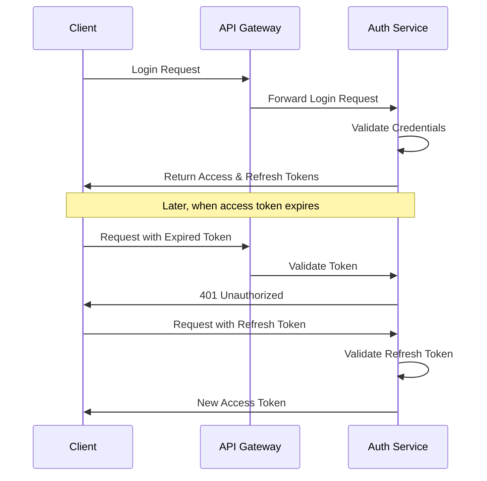

# Auth Service

The Auth Service is responsible for all authentication and authorization aspects of the AuctiOn platform.

## Responsibilities

- User authentication (login/logout)
- JWT token generation and validation
- Refresh token management
- Password reset functionality
- Token blacklisting for security

## Authentication Flow

The service implements a secure JWT-based authentication system with both access and refresh tokens:

## Security Features

### Token Blacklisting

When a user logs out, their tokens are added to a blacklist to prevent unauthorized use even if the tokens haven't
expired yet.

### Password Reset

The service provides a secure password reset flow:

1. User requests password reset
2. Service generates a time-limited reset token
3. Reset link is sent to user's email
4. User submits new password with the token
5. Service verifies token and updates password

## API Endpoints

| Endpoint                | Method | Description                                |
|-------------------------|--------|--------------------------------------------|
| `/auth/login`           | POST   | Authenticate user and issue tokens         |
| `/auth/refresh`         | POST   | Issue new access token using refresh token |
| `/auth/logout`          | POST   | Invalidate user tokens                     |
| `/auth/forgot-password` | POST   | Initiate password reset process            |
| `/auth/reset-password`  | POST   | Complete password reset with token         