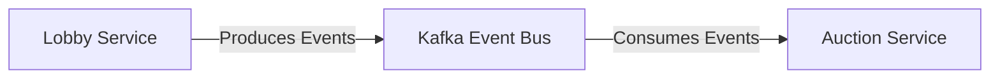

# Event-Driven Communication

AuctiOn uses an event-driven architecture for communication between microservices, with Apache Kafka as the event bus.

## Event Flow



## Event Types

The system uses several event types for inter-service communication:

### Lobby Events

| Event Type      | Description           | Producer      | Consumer        |
|-----------------|-----------------------|---------------|-----------------|
| `lobby-created` | New lobby created     | Lobby Service | Auction Service |
| `lobby-joined`  | Player joined lobby   | Lobby Service | Auction Service |
| `lobby-left`    | Player left lobby     | Lobby Service | Auction Service |
| `lobby-started` | Game started          | Lobby Service | Auction Service |
| `lobby-deleted` | Lobby deleted         | Lobby Service | Auction Service |
| `player-status` | Player status changed | Lobby Service | Auction Service |

### Auction Events

| Event Type             | Description                      | Producer        | Consumer |
|------------------------|----------------------------------|-----------------|----------|
| `player-connected`     | Player connected to auction      | Auction Service | Internal |
| `player-disconnected`  | Player disconnected from auction | Auction Service | Internal |
| `player-status-change` | Player status changed in auction | Auction Service | Internal |
| `end-round`            | Auction round ended              | Auction Service | Internal |
| `end-auction`          | Auction game ended               | Auction Service | Internal |
| `sale`                 | Item sale created                | Auction Service | Internal |
| `bid`                  | Bid placed                       | Auction Service | Internal |

## Event Schemas

Events are validated using Zod schemas to ensure type safety and consistency. Example schemas:

```typescript
// Lobby event schema example
export const lobbyCreatedEventSchema = z.object({
  type: z.literal('lobby-created'),
  lobby: auctionConfigSchema,
  creator: playerSchema.shape.id,
})

// Auction event schema example
export const bidEventSchema = z.object({
  type: z.literal('bid'),
  bid: bidSchema.omit({ playerId: true, timestamp: true }),
  auctionId: z.string(),
  playerId: z.string(),
  timestamp: z.string().datetime(),
})
```

## Benefits of Event-Driven Architecture

- **Loose coupling**: Services can evolve independently
- **Scalability**: Services can scale based on event load
- **Resilience**: Temporary service outages don't break the system
- **Audit trail**: Events provide a complete history of system actions 