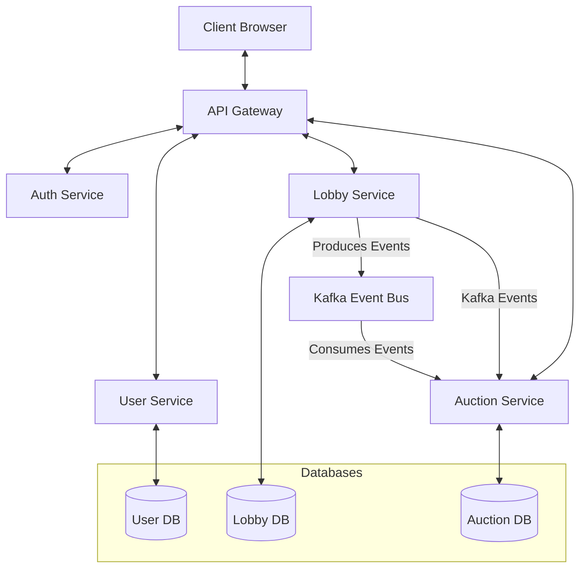

# System Architecture

AuctiOn is built on a modern microservices architecture, designed for scalability, maintainability, and real-time
performance. The system is composed of several specialized services that communicate with each other through REST APIs
and event-driven patterns using Kafka.

## Architecture Diagram

## Key Components

The AuctiOn platform consists of the following key services:

- **API Gateway**: Routes requests to appropriate services and handles authentication verification
- **Auth Service**: Manages user authentication and authorization
- **User Service**: Handles user profile data and management
- **Lobby Service**: Manages game lobbies and player matchmaking
- **Auction Service**: Powers the real-time auction gameplay mechanics
- **Kafka Event Bus**: Enables asynchronous communication between services

Each service is designed to be independently deployable and scalable, following microservices best practices. 