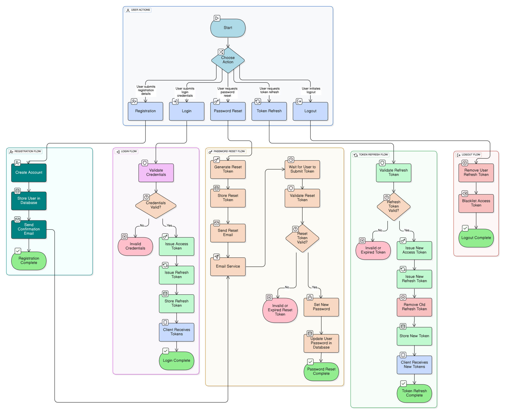

# Auth Service: Behaviour

## Authentication Workflow

- Registration: User submits credentials, account is created, confirmation email sent.
- Login: Credentials validated, access and refresh tokens issued.
- Token Refresh: Client presents a valid refresh token to obtain a new access token.
  On each refresh, a new refresh token is also issued and the old one is invalidated.
- Logout: All active tokens for the user are blacklisted to prevent further use.
- Password Reset: A short lived reset token is generated and sent to the user's email.
  The user can use this token to securely set a new password.

### Token Lifecycle and Blacklisting

- **Access Token**: Short-lived, used for authenticating API requests.
  If expired, the client must use a refresh token to obtain a new one.
- **Refresh Token**: Long-lived, used to obtain new access tokens.
  On each refresh, a new refresh token is issued, and the previous one is invalidated (**rotated**).
  This reduces the risk of token theft and replay attacks.
- **Reset Token**: Single-use, time-limited token sent to the user's email for password reset.
  It allows the user to securely set a new password without exposing credentials.
- **Blacklisting**: When a user logs out or a refresh token is rotated,
  the old tokens are added to a blacklist. This ensures that even if a token is stolen,
  it cannot be used after logout or after a refresh, providing robust session invalidation and security.

> Click <a href="../../images/AuthBehavior.svg" target="_blank">here</a> to enlarge

Token state management ensures security,
support for revocation, and robust session handling.
Token rotation and blacklisting provide strong guarantees against replay and session hijacking.
The reset token mechanism enables secure password recovery without exposing sensitive data. 