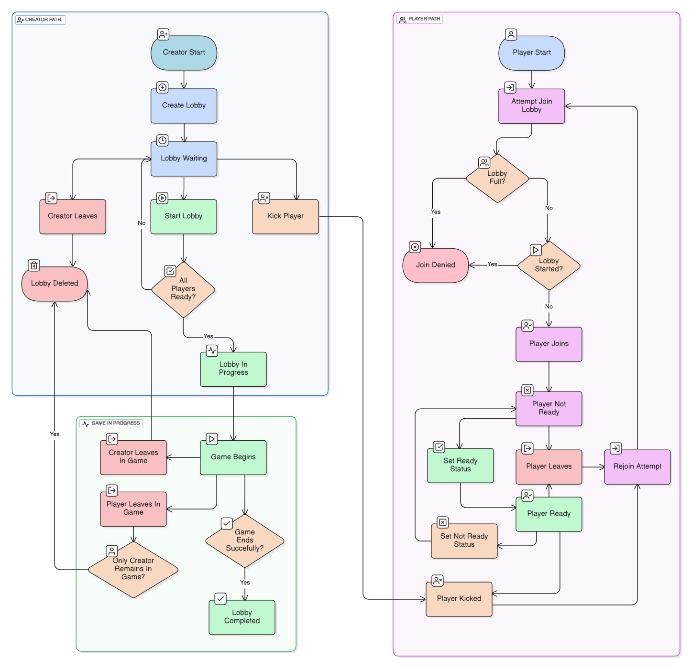

# Lobby Service: Behaviour

## Lobby Lifecycle

The lobby entity transitions through these states:

- Waiting: Lobby created, waiting for players.
- InProgress: The game starts, and the lobby is in-progress.
- Completed: Game ends successfully.

These are the following rules for the lobby lifecycle:

- The lobby is created by the creator.
- Players can join or leave a lobby if it is not full or already in-progress.
- The lobby can be started by the creator if all players are ready.
- The lobby can be deleted by the creator at any time.
- If players leave the lobby and only one player remains (the creator), the lobby is deleted.
- If the lobby is deleted, all players are removed.
- If the game ends successfully, the lobby is marked as completed.

## Player States in Lobby

- Ready: Player is ready to start.
- Not-Ready: Player is not ready.

> The creator does not have a ready state, as they are always ready to start the game.

> Click <a href="../../images/LobbyBehavior.svg" target="_blank">here</a> to enlarge

Stateful lobby management allows for robust handling of player readiness,
joining/leaving, and smooth transition to gameplay. 