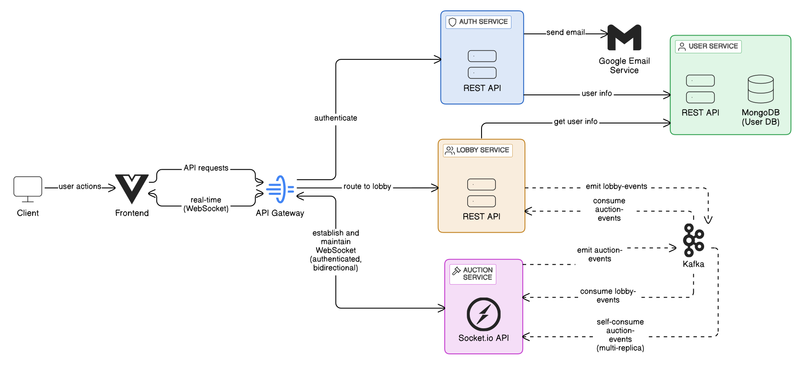
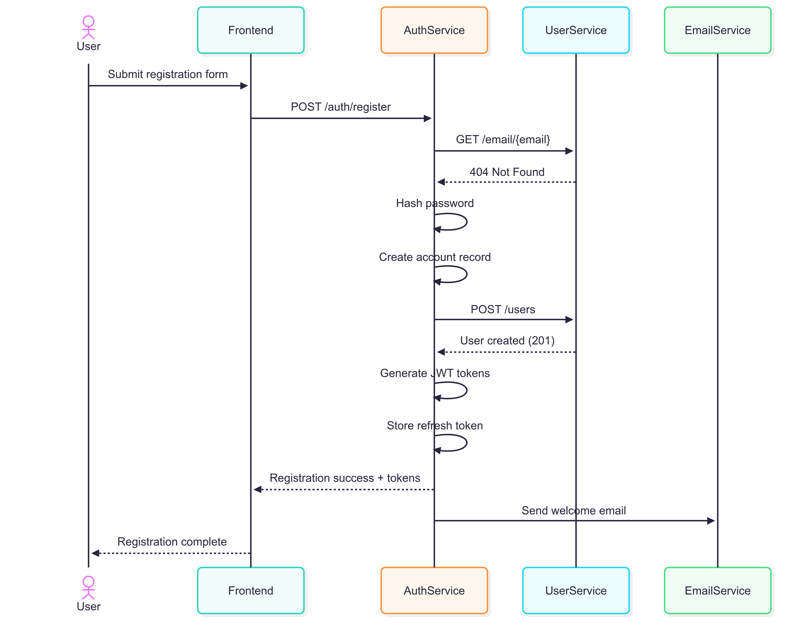
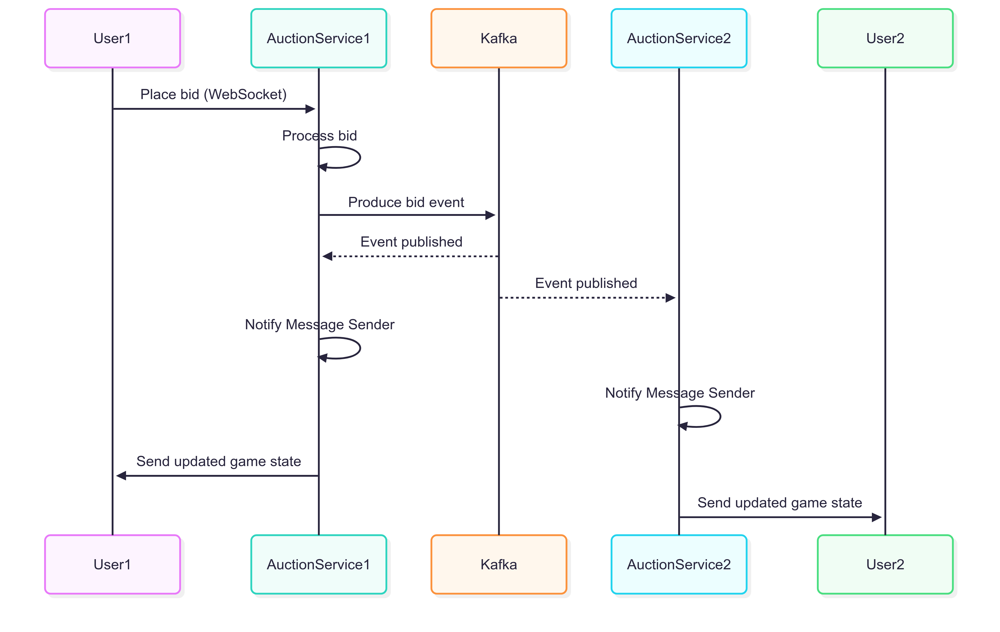
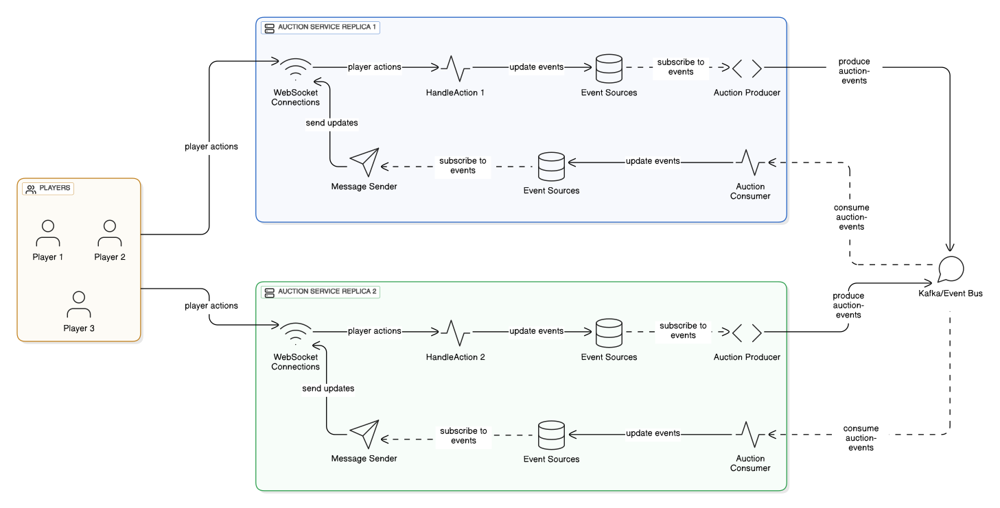

# Design: Interaction

This section details how the various services in the microservice architecture
interact with each other to enable the auction game functionality.

## Communication Patterns

The system employs three primary communication patterns, each selected for specific interaction requirements:

1. **REST APIs**: Used for synchronous request-response communications between services
2. **Event-Driven Communication**: Implemented with Kafka for asynchronous service-to-service communication
3. **WebSockets**: Employed for real-time bidirectional communication between clients and the auction service

## Service Interaction Model



The system uses an **API Gateway** to manage incoming requests and route them to the appropriate service.
It also handles authentication, ensuring that only valid requests reach the services.
The details of the interactions between the services are outlined below.

### Authentication Service Interactions

The Authentication Service functions as the entry point for user authentication and primarily interacts with:

- **User Service**: Via REST API calls to:
    - Validate user existence
    - Retrieve user information (UID, email)
    - Verify user credentials during authentication operations
- **External Email Service**:
    - Sends emails during registration
    - Sends password reset emails



### Lobby Service Interactions

The Lobby Service manages pre-game operations and communicates through:

- **Event Production**: Emits `lobby-events` to Kafka when:
    - A new lobby is created
    - A player joins a lobby
    - A player leaves a lobby
    - A player changes status (e.g., ready, not ready)
    - A game is started by the lobby creator
    - A game is deleted

- **Event Consumption**: Consume `auction-events` to:
    - Mark lobbies as completed when an auction game ends
    - Release players to join other lobbies

### Auction Service Interactions

The Auction Service handles all in-game logic and interacts through:

- **Event Consumption**:
    - Processes `lobby-events` to:
        - Register new lobbies for accepting connections
        - Track player joins/leaves from lobbies
        - Initialize auction games when lobbies start
    - Process `auction-events` to:
        - Notify the connected players of game state changes via WebSocket (See below)

- **Event Production**: Emits `auction-events` when:
    - An auction game is completed
    - Game state changes that affect lobby status
    - Player actions (e.g., bids, sales) occur

- **WebSocket Connections**: Maintains direct real-time connections with clients for:
    - Receiving player actions
    - Broadcasting auction updates
    - Managing player connection status



Why does the auction service both produce and consume `auction-events`?

The auction service is designed for scalability through replication.
Each instance manages connections for a **subset** of players, meaning players in the same auction
may connect to different instances. To ensure all players receive relevant updates,
each instance produces `auction-events` for its connected players and consumes events
from other instances (including itself).



There is no direct link between the system services and the **Message Sender** component.
The **Auction Consumer** component aggregates all `auction-events` and serves as
the primary source of truth for the **Message Sender** component.
It implements all the Event Sources Interfaces.

````typescript
class AuctionConsumer
  implements AuctionEventsSource,
    UserEventSource,
    TimerEventSource,
    PlayerEventSource
````

The **Message Sender** relies on the **Auction Consumer** to broadcast relevant
events to connected players.

```` typescript
class MessageSender {
    constructor(
        auctionEventsSource: AuctionEventsSource,
        playerEventSource: PlayerEventSource,
        userEventSource: UserEventSource,
        timerEventSource: TimerEventSource
    )
} ...
````

Connecting the message sender with the Auction Consumer, enables the support for multiple instances.
Otherwise, making the **MessageSender** subscribe to the actual services that generate the
events (AuctionService, UserService ...), will only work with a single instance.
Each instance of the Auction Service will consume all the events from the auction-event topic.
While this is needed to ensure that all players receive the auction updates,
there is no need that each replica consumes event from the `lobby events` topic.
All the **Lobby Consumer** of the instances are part of the same consumer group,
ensuring that a single event is processed by a single instance of the service.
The consistency of the game state is maintained by using the **same repository** for all instances.
This architecture supports horizontal scaling while maintaining consistency across instances.
The approach to managing game state across instances and avoiding inconsistencies is detailed [here](../implementation).

## Event System

The event-driven communication between the Lobby Service and Auction Service is crucial
for maintaining system state consistency while preserving service independence.
The following table outlines the events produced by the two services:

### Lobby Events

| Event Type    | Producer      | Consumer        | Purpose                                                |
|---------------|---------------|-----------------|--------------------------------------------------------|
| lobby-created | Lobby Service | Auction Service | Notifies when a new lobby is available for connections |
| lobby-joined  | Lobby Service | Auction Service | Updates which players belong to a lobby                |
| lobby-left    | Lobby Service | Auction Service | Updates when a player leaves a lobby                   |
| lobby-started | Lobby Service | Auction Service | Triggers the initialization of an auction game         |
| lobby-deleted | Lobby Service | Auction Service | Notifies when a lobby is deleted                       |
| player-status | Lobby Service | Auction Service | Updates the ready status of a player in the lobby      |

### Auction Events

| Event Type          | Producer        | Consumer      | Purpose                                                    |
|---------------------|-----------------|---------------|------------------------------------------------------------|
| player-connected    | Auction Service | Lobby Service | Notifies when a player connects to an auction game         |
| player-disconnected | Auction Service | Lobby Service | Notifies when a player disconnects from an auction game    |
| player-update       | Auction Service | Lobby Service | Updates player information during the auction              |
| timer-start         | Auction Service | Lobby Service | Notifies when a bidding timer starts                       |
| end-round           | Auction Service | Lobby Service | Signals the end of a bidding round                         |
| end-auction         | Auction Service | Lobby Service | Signals game completion so lobby can be marked as finished |
| sale                | Auction Service | Lobby Service | Notifies when a player puts items up for sale              |
| bid                 | Auction Service | Lobby Service | Notifies when a player places a bid                        |

All the events structures are defined in a **shared kernel** module, named `Common`.
The event-driven architecture allows for loose coupling between services,
enabling them to evolve independently while still maintaining a consistent state across the system.
Future implementations may include a _statistics-service_ that consumes auction events to track player performance
and game statistics.

## Message System

The system implements a real-time message system for bidirectional
communication between the frontend clients and the auction service.
This communication is essential for delivering time-sensitive auction updates and receiving player actions.

### WebSocket Communication

WebSockets are used to establish persistent connections between clients and the server, allowing for:

1. **Bidirectional Communication**: Enables both server-to-client (auction updates) and
   client-to-server (player bids) messages
2. **Low Latency**: Minimizes delay in auction updates, critical for competitive bidding
3. **Connection State Awareness**: Allows the system to track which players are actively connected

The API Gateway proxies WebSocket connections from clients to the Auction Service,
maintaining authentication context while providing a single entry point for all client communications.

### Message Types

The system defines a comprehensive set of message types to handle various aspects of the auction.
All messages follow an event-like schema with a `type` field that enables easy message type
detection and routing:

| Message Type        | Direction       | Purpose                                        |
|---------------------|-----------------|------------------------------------------------|
| player-connected    | Server → Client | Notifies when a player connects to the auction |
| player-disconnected | Server → Client | Notifies when a player disconnects             |
| player-join         | Server → Client | Announces a new player joining the auction     |
| player-leave        | Server → Client | Announces a player leaving the auction         |
| new-bid             | Server → Client | Broadcasts when a new bid is placed            |
| new-sale            | Server → Client | Broadcasts when a new item is put up for sale  |
| auction-start       | Server → Client | Signals the start of an auction                |
| auction-end         | Server → Client | Signals the end of an auction                  |
| round-end           | Server → Client | Signals the end of a bidding round             |
| timer-start         | Server → Client | Notifies when a bidding timer starts           |
| bid                 | Client → Server | Sent when a player places a bid                |
| sell                | Client → Server | Sent when a player puts items up for sale      |
| time-sync           | Client → Server | Used to synchronize client and server time     |

The event-like schema approach provides several benefits:

1. **Type Safety**: Using Zod for schema validation ensures type safety across the system
2. **Consistent Structure**: All messages follow a predictable pattern with a `type` discriminator
3. **Easy Routing**: The message type can be used to route messages to appropriate handlers

### State Reconstruction for Reconnecting Players

A critical feature of the message system is its ability to handle player reconnections gracefully.
When a player reconnects to an ongoing auction, the system must reconstruct the current auction state
for them.

This is accomplished through the `old` field present in several message types:

The `old` field serves as a marker to distinguish between:

- **State Reconstruction Messages** (`old: true`): These messages are sent only to a reconnecting player
  to rebuild their view of the current auction state.
  They represent historical events that occurred while the player was disconnected.
- **Real-Time Updates** (`old: false`): These are new events occurring in real-time that should be
  processed as normal updates.

When a player reconnects, the `MessageSender` component:

1. Sends the current auction state with `old: true`
2. Sends information about all connected players with `old: true`
3. Begins sending real-time updates with `old: false`

This approach ensures that reconnecting players can seamlessly rejoin ongoing auctions
without missing critical information, while also avoiding confusion between historical and current events.

## Design Rationale

The interaction design delivers several key benefits:

1. **Service Autonomy**: Each service maintains ownership of its domain and can evolve
   independently without tight coupling

2. **Communication Pattern Appropriateness**:
    - REST APIs for user data retrieval where immediate responses are needed
    - Event-driven for cross-service state changes to support eventual consistency
    - WebSockets for real-time game interactions to support bidirectional communication

3. **Scalability**: The event-driven architecture allows independent scaling of
   services according to load patterns

4. **Resilience**: Services can continue functioning when other services are temporarily unavailable,
   with event processing resuming when connections are restored

### Alternative Approaches Considered

1. **Direct Service-to-Service REST Calls**: We considered having the Auction Service directly call the Lobby Service
   API to update lobby status. This approach was rejected because:
    - It would create tighter coupling between services
    - It would introduce synchronous dependencies that reduce system resilience
    - It would make the system less tolerant to partial failures

2. **Shared Database**: Using a shared database between Lobby and Auction services was initially considered but rejected
   due to:
    - Violation of service boundaries and domain isolation
    - Reduced autonomy for schema evolution
    - Potential performance bottlenecks

## Possible Improvements

### Connection Service Extraction

The current architecture has the Auction Service performing dual responsibilities:

- **Managing game logic**
- **Handling player connections**.

This leads to the somewhat inefficient pattern where the service both produces and consumes
its own `auction-events` to ensure all connected players receive updates.

A more elegant solution would be to extract the connection management
into a dedicated **Connection Service** that would:

1. Maintain all WebSocket connections with players
2. Consume `auction-events` directly from Kafka
3. Route relevant updates to the appropriate connected players

This separation of concerns would offer several benefits:

- **Simplified Auction Service**: The Auction Service could focus solely on game
  logic without managing connections
- **Eliminated Self-Consumption**: Auction Service instances would no longer need to consume their own events
- **Improved Scalability**: Connection management could scale independently from game logic processing
- **Enhanced Maintainability**: Clearer boundaries between connection handling and business logic

While this approach would introduce additional architectural complexity,
it would result in a more maintainable system with better separation of concerns and reduced message overhead.