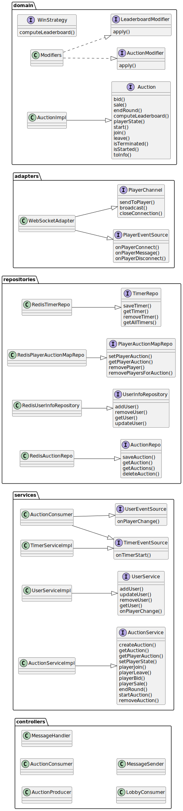

# Auction Gameplay Context

## Overview

The Auction Gameplay Context is design as an independent microservice responsible for all gameplay logic and state for
the auction-based game. It manages the lifecycle of an auction, player actions (such as bidding and selling), and the
real-time progression of the game. This context is designed to be performance-sensitive and to keep gameplay logic
separate from pre-game (lobby) and user management concerns.

## Main Entities

- **Auction**: Represents a running auction game with its internal state.
    - **ID**: Unique identifier for the auction.
    - **Players**: List of users participating in the auction, each with their own state.
    - **Status**: Indicates the auction's state (e.g., `waiting`, `in-progress`, `completed`).
    - **Rounds**: The current round and total number of rounds in the auction.
    - **Items**: The items available for bidding and sale in the auction.
    - **Leaderboard**: The final results of the game, based on player performance.

- **Player**: Represents a user participating in the auction, including their current game state (inventory, money,
  etc.).
- **Bid**: An offer made by a player during an auction round.
- **Sale**: A transaction where a player offers items for bidding.
- **Leaderboard**: The final ranking of players at the end of the auction.

## Components

The Auction Gameplay Context is organized into the following components:

- **Auction**: The main entity representing the auction game. It keeps the internal game state and
  handles all the game logic.
- **Player Channel**: Represent the connection to the player, allowing for real-time communication and updates.
- **Services**:
    - **Auction Service**: Encapsulates business logic for auction management and
      orchestrates operations across repositories. It uses the auction entity to perform auction operations.
    - **Timer Service**: Handles timing for rounds, bidding windows, and auction timeouts,
      ensuring the game progresses in real time.
    - **User Service**: Used to handle information of the players that are in the auctions.
- **Events Sources**: Interfaces that define events that other components can subscribe to.
    - **Player Event Source**: A source of events related to players,
      such as player connection/disconnection and player messages.
    - **Auction Event Source**: A source of events related to auction state changes,
      such as auction start/end, and round transitions.
    - **User Event Source**: A source of events related to user information changes,
      such as user profile updates and user status changes.
    - **Timer Event Source**: A source of events related to timer events,
      such as timer start events.
- **Repository Layer**:
    - **Auction Repository**: Stores and retrieves auction game state.
    - **Player Map Repository**: Stores and retrieves the player-auction mapping for fast lookup.
    - **Timer Repository**: Stores and retrieves timers for each auction.

- **Lobby Consumer**: Consumes lobby events to update auction state based on external triggers.
- **Auction Producer**: Publishes auction events to notify other services of game state changes.
- **Auction Consumer**: Consumes auction events and notify listeners of the corresponding events.
  This class implements all the Event Sources defined before, since it is the source of truth for all the auction
  related events.
- **Message Handler**: Handles incoming external user/game messages, validates input, and delegates to the service
  layer.
- **Message Sender**: Sends messages to players in the auction,
  such as notifications of bids, sales, and auction state changes.

> Click <a href="../../images/AuctionComponents.svg" target="_blank">here</a> to enlarge

## UML Package Diagram

The **Domain** module contains the core domain entities and logic,
including the Auction, Player, Bid, Sale, and Leaderboard classes.
It is isolated from the rest of the system to ensure a clean separation of concerns.

## Alternative Designs Considered

- **Stateless Auctions**: Using only in-memory auctions was considered,
  but persistent storage was chosen to support scalability.
