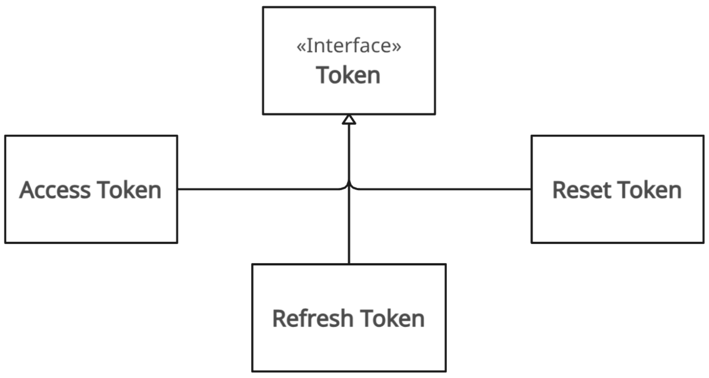
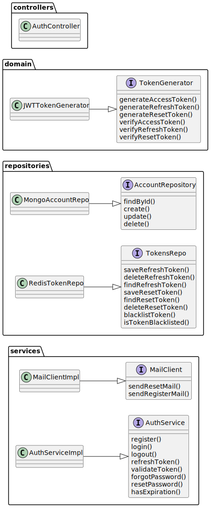

# Authentication Context

## Overview

The Authentication Context is designed as an independent microservice responsible for user authentication,
credential management, and secure session handling.

## Main Entities

- **Account**: Represents the authentication credentials of a user.
  Stores only the password hash, never the plain password and associates it with a user ID.
    - **Password Hash**: Securely hashed password.
    - **User ID**: Unique identifier for the user in the system.

- **Token**: Represents session and access grants. It can be:
    - **Access Token**: Short-lived token for API authentication.
    - **Refresh Token**: Long-lived token, stored server-side for session renewal and revocation.
    - **Reset Token**: Single-use token for password reset flows.

- **User**: Minimal user information required for authentication (ID).
  Full user profiles are managed in a separate context.

## Components

The Authentication Context is organized into the following components:

- **Controller**: Handles HTTP requests and responses, validates input, and delegates to the service layer.
- **Auth Service**: Encapsulates authentication logic, orchestrates operations across repositories, token management.
- **Repository Layer**
    - **Account Repository**: Stores and retrieves account credentials.
    - **Token Repository**: Persists refresh and reset tokens, including blacklisting for logout or security.

- **Token Generator**: Handles token creation, validation, and expiration for access, refresh, and reset tokens.
- **Mail Service**: Sends registration and password reset emails using a pluggable mail client.

---

## UML Class Diagram

## Alternative Designs Considered

- **Stateless Token Only** Using stateless JWTs without server-side storage was considered,
  but rejected to enable token revocation (logout, password reset) and blacklisting.