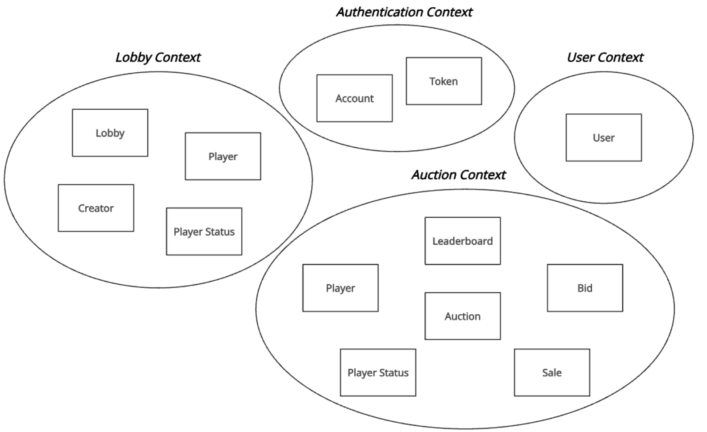

# Design: Structure

## Overall Decomposition

The system has been structured according to Domain-Driven Design (DDD) principles,
with each core business capability encapsulated within its own **bounded context**.
This decomposition supports modularity, separation of concerns, and alignment with the problem domain.
The bounded contexts are as follows:

- **Authentication Context**
- **User Management Context**
- **Lobby Management Context**
- **Auction Gameplay Context**

Each bounded context defines its own domain model and ubiquitous language,
and they interact through well-defined contracts.
This design encourages clear domain ownership and simplifies reasoning about each part of
the system independently.

## Bounded Contexts

### Authentication Context

**Purpose:** Responsible for user identification,
credential validation, and authentication workflows.

**Core Domain Concepts:**

- **Account** – Represents a user’s credentials and authentication information.
- **Token** – A secure representation of a user’s session, used for API access.

Authentication context was modeled to isolate security-sensitive logic.
This ensures a focused and controlled domain that can evolve independently of other aspects of the system,
such as user metadata or gameplay related user information.

### User Management Context

**Purpose:** Handles user-related information such as usernames, emails, and other profile data.

**Core Domain Concepts:**

- **User** – Includes a unique ID, username, email, and domain-relevant metadata.

User profile data often evolves independently.
Decoupling it allows flexibility in modifying profile features without
impacting authentication logic. Future game logic update may need to add some user data
that are independent of the authentication process.

### Lobby Management Context

**Purpose:** Handles all the lobby related functionalities.

**Core Domain Concepts:**

- **Lobby** – A virtual space where players gather before starting a game.
  It holds settings of the game, status, and players.
- **Player** – Represents a user in a particular lobby.
- **Player Status** – Indicates whether a player is ready to start the game or not.
- **Creator** – A designated user with elevated permissions within the lobby.
  He is always the player that created the lobby. He is the one that can start the game.

By isolating the logic and rules around lobbies, such as joining/leaving, ownership,
and kicking users, this bounded context allows for flexible management without polluting gameplay
logic or user identity.
Additionally, defining the Lobby Management Context separates the pre-game logic,
such as handling the ready state or managing lobby joining, from the in-game logic,
ensuring a clear distinction between pre-game and gameplay responsibilities.

### Auction Gameplay Context

**Purpose:** Handles all gameplay logic and state for the auction-based game.

**Core Domain Concepts:**

- **Auction** – Represents a started auction game with its internal state.
- **Player** – Represents a user participating in the auction,
  including their current game state (inventory, money...).
- **Player Status** – Indicates the current connection status of a player in the auction
  (e.g., connected, not-connected).
- **Bid** – An offer made by a player during an auction round.
- **Sale** – A transaction where a player offers any items for bidding.
- **Leaderboard** – The final results of the game, based on their performance in the auction.

Game logic is often complex and performance-sensitive.
Defining a dedicated bounded context allows for optimized modeling of gameplay rules,
event sequencing, and real-time behavior,
independent of user, lobby, or authentication concerns.

## Alternative Designs Considered

- **Unified User Context**: Combining authentication and user profile into a single context was considered,
  but with a view to future expansion of the system, with the addition of a friendship system,
  splitting the two contexts seemed the best choice
- **Unified Game Context**: Initially evaluated whether lobby and auction
  could be combined into one game context. Ultimately rejected in favor of clearer separation of pre-game
  and in-game responsibilities.