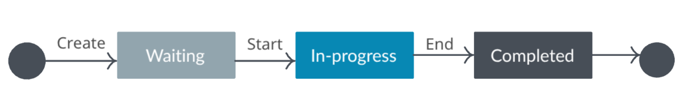
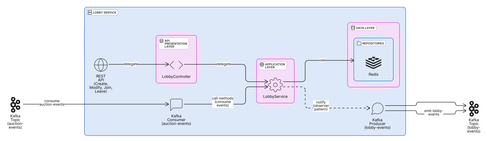
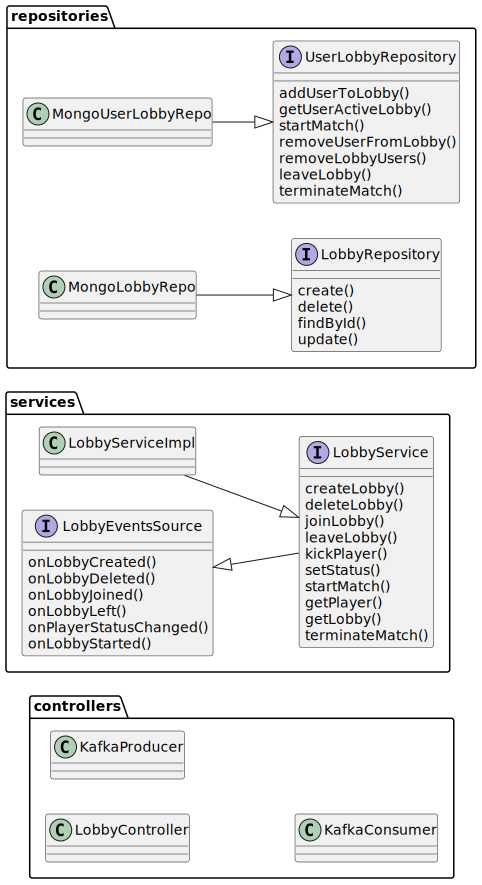

# Lobby Management Context

## Overview

The Lobby Management Context is designed as an independent microservice responsible for all lobby-related
functionalities. It manages the lifecycle of lobbies, player membership, player status, and the transition from pre-game
to in-game state. A key responsibility is handling users joining and leaving lobbies - with the ability to leave or be
kicked from a lobby even after the game has started. This context is designed to keep pre-game logic separate from
gameplay and user management, supporting scalability and clear domain boundaries.

## Main Entities

- **Lobby**: Represents a virtual room where players gather before starting a game.
    - **ID**: Unique identifier for the lobby.
    - **Creator**: The user who created the lobby and has elevated permissions.
    - **Players**: List of users in the lobby, each with a status.
    - **Status**: Indicates the lobby's state (`waiting`, `in-progress`, `completed`).
    - **Config**: Game settings such as max players, rounds, starting inventory, etc.

- **Player**: Represents a user in a specific lobby, including their status (`ready`, `waiting`).
  

## Components

The Lobby Management Context is organized into the following components:

- **Controller**: Handles externals user messages, validates input, and delegates to the service layer.
- **Lobby Service**: Encapsulates business logic for lobby management, orchestrates operations across repositories, and
  exposes event listeners that external controllers can subscribe to for monitoring lobby state changes (e.g., lobby
  joined, left, created, deleted, started).
- **Repository Layer**:
    - **Lobby Repository**: Persists and retrieves lobby data.
    - **UserLobby Repository**: Tracks user-to-lobby relationships for fast lookup and to store user state in a specific
      lobby.
- **Kafka Producer**: Publishes lobby events to notify other services of lobby state changes.
- **Kafka Consumer**: Consumes auction events to update lobby state based on game progress.

{width=1550px height=100px}
> Click <a href="../../images/LobbyComponents.svg" target="_blank">here</a> to enlarge

## UML Class Diagram

