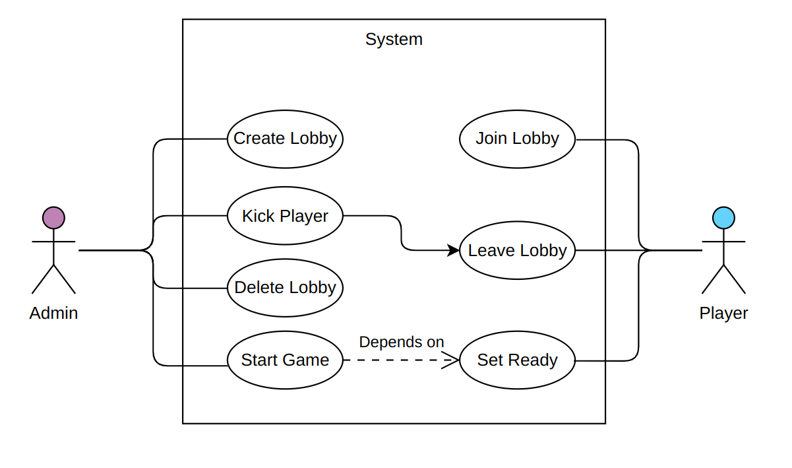
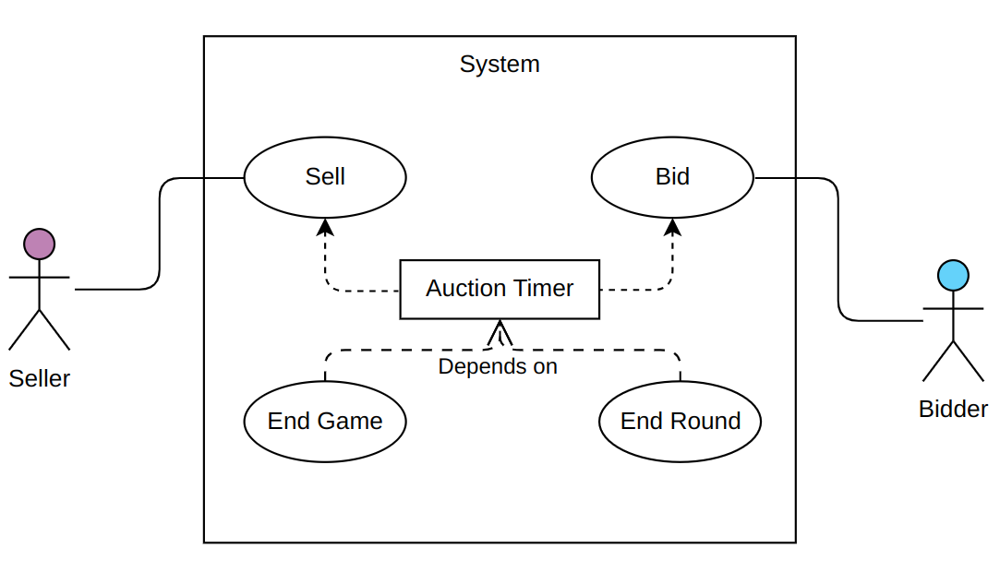
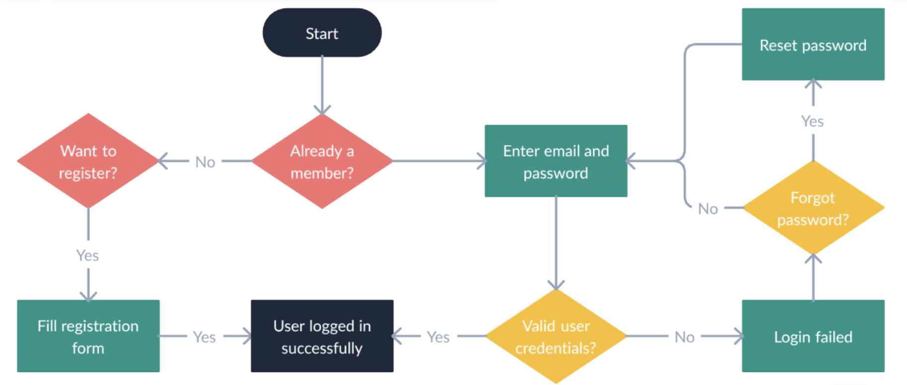
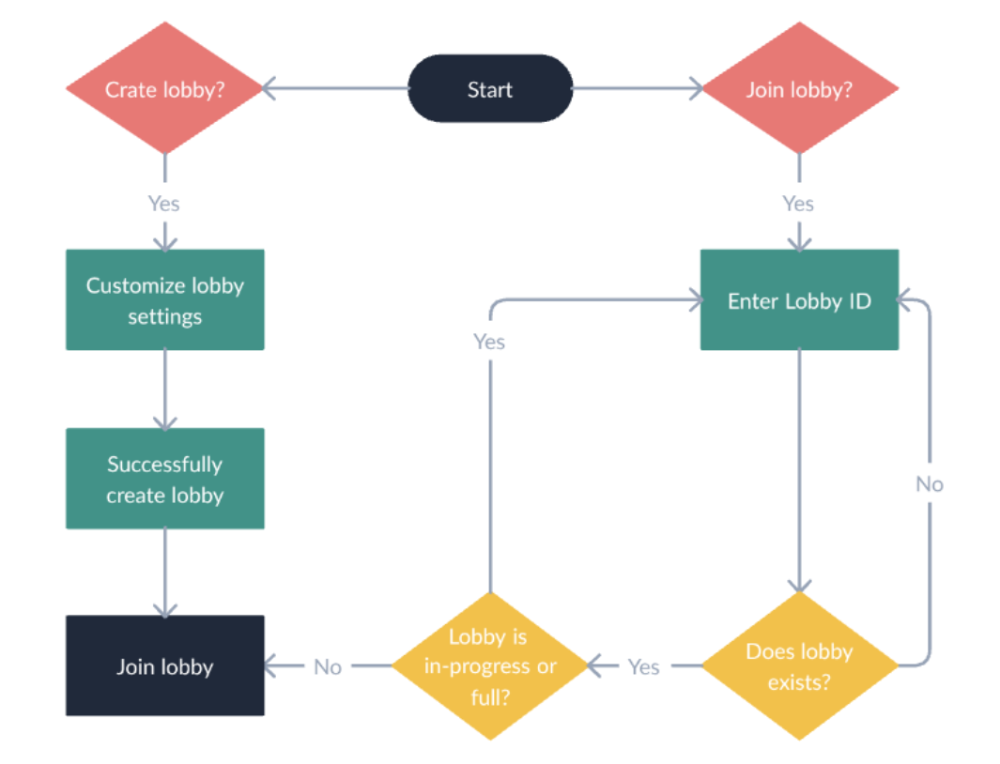

# Goal & Requirements

The primary goal of the AuctiOn project was to design and implement a real-time,
multiplayer online auction game platform.
The system was developed adhering to specific functional and architectural requirements outlined below.

## Functional Requirements

### User Authentication:

The platform must support user authentication functionalities to
manage player identities.

* Players must be able to register using their email and password.
* Players must be able to log in using their registered email and password.
* Players must be able to log out of the system.
* Players must be able to reset their password using their email.

### Lobby System:

* Players must be able to create new game lobbies.
* Lobbies must be joinable by other players, potentially via a unique link or code.
* Players can set ready status to indicate their availability for game initiation.
* The lobby creator controls the initiation of the game session once all players are ready.
* A player can always leave the game, but he will not be able to rejoin if the game is in progress.
* The lobby creator can always kick a player from the game.

### Gameplay:

The core gameplay loop involves turn-based auctions where players act as **sellers** and **bidders**,
aiming to maximize their virtual currency according to the defined [Game Rules](../game-rules).

* A seller should be able to sell items.
* A bidder should be able to bid on items.
* Each round is time-limited, and players must bid within the specified time.
* If the auction timer expires, the game should automatically proceed to the next round.
* If the maximum number of rounds is reached, the game should conclude.
* On each valid bid, the timer should reset to the default value.

### Disconnection Handling:

* Players must be able to disconnect and subsequently reconnect to an ongoing game.
* If a player disconnects, the game should proceed.
* If a player disconnects, and he is the next seller, his selling turn should be skipped.

### Leave and Kick Handling:

* If the seller leaves the game or is kicked, his turn will be skipped.
* If the lobby creator leaves the game before selling any item,
  the game will be deleted and all players will be kicked.

::: details Q: What happens to the seller queue when a player leaves the game?
A: When a player leaves the game, they are completely removed from the seller queue.
This ensures that the game flow remains uninterrupted, with the next available player taking the selling role.
:::

### Game Conclusion:

* Upon completion of the game (e.g., after a set number of rounds),
  a leaderboard displaying player rankings must be presented.

## Architectural & Technical Requirements

* **Microservices Architecture:** The system must be implemented using a microservices-based architecture
  to ensure modularity, scalability, and independent deployability of components.
* **Technology Stack:** The project must primarily utilize the **MEVN** stack (MongoDB, Express.js, Vue.js, Node.js),
* supplemented by technologies appropriate for real-time communication (Socket.IO)
  and inter-service communication (Kafka).

## Optional Requirements

* **Player Statistics:** Implement a dedicated section for each player displaying historical game data and
  performance statistics.

## Scenarios

The users can interact with the system through a web interface. These are the main expected scenarios:

* **User Authentication:**
    1. **Registration:** A new user navigates to the registration page, provides their email address and a chosen
       password, and submits the form.
       The system validates the input and creates a new user account.
    2. **Login:** A registered user goes to the login page, enters their email and password, and submits the form.
       The system verifies the credentials and, upon success, grants the user access to the platform.
    3. **Password Reset:** If a user forgets their password, they can initiate a password reset process.
       They enter their registered email address on the password reset page.
       The system sends a password reset link or code to their email.
       The user follows the instructions in the email to set a new password.
    4. **Logout:** An authenticated user can choose to log out.
       The system terminates their session, requiring them to log in again for future access.

* **Lobby Scenario:**
    1. **Lobby Creation/Joining:** A player either creates a new game lobby or joins an existing one (e.g., using a
       unique ID).
    2. **Waiting Room:** Players gather in the lobby.
       They can see other joined players and notify their readiness to start.
    3. **Game Start:** Once all desired players have joined and marked themselves as ready,
       the lobby creator can initiate the game session.

::: details Q: What happens if a player leaves as ready and rejoins the lobby?
A: If a player leaves the lobby while marked as ready and then rejoins,
they will be automatically set to not ready.
They must indicate again their readiness for the game.
:::

* **Gameplay Scenario:**
    1. **Seller Turn:** The designated seller for the current round chooses any number of items from his inventory
       to put up for auction.
    2. **Bidding Phase:** Other players act as bidders, placing bids within a time limit.
       The bidders do not know which items are being auctioned, but they can see some aggregated information about the
       items.
       Each valid bid resets the timer.
    3. **Round End:** The auction ends when the timer runs out or a player wins the bid.
       The highest bidder pays the seller, and the items are transferred to the bidder.
    4. **Next Turn:** The role of the seller rotates, according to the predefined order (handling skips for
       disconnected/left players).
    5. **Game Conclusion:** The game continues for a set number of rounds.
       Upon completion, the final scores are calculated, and a leaderboard is displayed showing player rankings.

::: details Q: How is the seller rotation determined?
A: The seller rotation follows a random order established at the beginning of the game.
If a player disconnects, their turn will be skipped, and the next player in line becomes the seller.
The order is maintained throughout the game.
:::

::: details Q: What information do bidders see about the auctioned items?
A: Bidders only see the total weight of the batch being auctioned, not the specific items or their quantities.
This limited information is a core gameplay mechanic that encourages strategic bidding and bluffing.
:::

::: details Q: What happens if no one bids during a round?
A: If no player places a bid during a round and the timer expires,
the items remain with the seller, and the game proceeds to the next seller in the rotation.
:::

## Self-assessment policy

The quality of the project will be assessed based on the following criteria:

- Successful implementation of the core functional requirements.
- Adherence to the architectural and technical requirements.
- Testing and documentation.
- Code quality and test coverage.