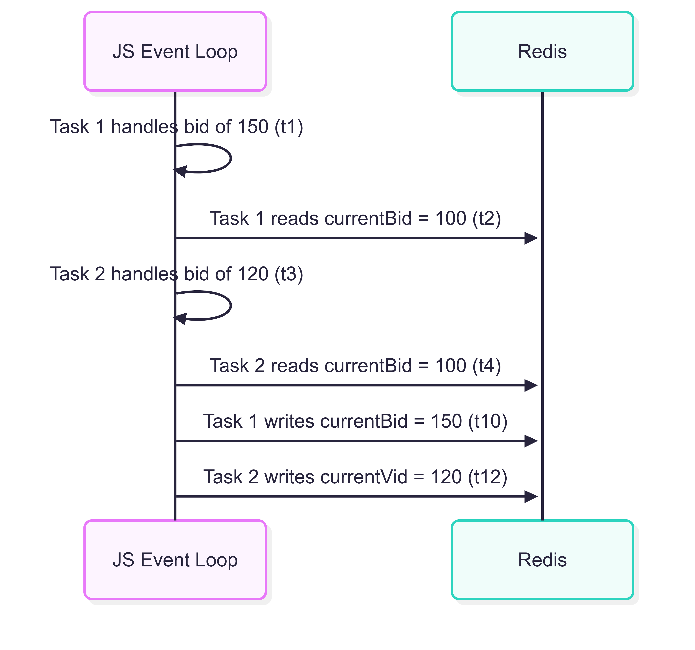

# Implementation Details

## Redis Locks

The auction service implements a **robust concurrency control mechanism** to
maintain **data consistency** across both single-replica and multi-replica deployments.
This approach is critical for auction integrity where race conditions could lead to invalid game states.

### The Concurrency Challenge

The auction service faces two primary concurrency challenges:

1. **Single-Replica Concurrency**: Within a single service instance,
   asynchronous operations can lead to **race conditions** when multiple functions attempt to
   read and modify the same Redis resources concurrently.

2. **Multi-Replica Concurrency**: When the auction service is **horizontally scaled**, multiple
   replicas may simultaneously attempt to modify the same auction state,
   potentially overwriting each other's changes.

### Concurrency in JavaScript's Single-Threaded Environment

Despite JavaScript's event loop being single-threaded, concurrency issues still arise due
to the **asynchronous nature** of I/O operations. Consider this diagram illustrating how race conditions
can occur even in a single-threaded environment:



In this scenario, the higher bid (150) is overwritten by the lower bid (120) due to the interleaving
of asynchronous operations, leading to an **inconsistent state**.

### Evolution of the Locking Mechanism

#### Initial Approach: AsyncLock for Single Instance

Initially, the auction service used the [async-lock](https://www.npmjs.com/package/async-lock)
library to provide **in-memory locking** within a single service instance:

```typescript
private
asyncLock: AsyncLock

constructor()
{
  this.asyncLock = new AsyncLock()
}

async
withLock<T>(key
:
string, task
:
() => Promise<T>
):
Promise < T > {
  return this.asyncLock.acquire(key, async () => {
    return await task()
  })
}
```

This approach worked well for a single service instance by:

1. **Queuing concurrent operations** on the same resource, ensuring they're processed sequentially
2. Preventing race conditions within the single instance's event loop
3. Providing a clean abstraction for executing code within a **critical section**

However, as the system evolved to support horizontal scaling with multiple service instances,
this approach became insufficient as it couldn't prevent concurrent modifications from
different service instances.

#### Current Approach: Redis-based Distributed Locking

To address the limitations of the in-memory locking approach, the system now uses **Redis**
to implement **distributed locks** based on the
[Redis Lock algorithm](https://redis.io/glossary/redis-lock/) algorithm:

```typescript
async
runWithLock<T>(
        lockKey
:
string,
        ttlMs
:
number,
        task
:
() => Promise<T>,
        retryDelayMs = 100
):
Promise < T > {
  const lockId = await this.acquireLock(lockKey, ttlMs, retryDelayMs)
   if(!
lockId
)
{
   throw new Error(`Failed to acquire distributed lock for ${lockKey}`)
}
try {
   return await task()
} finally {
   await this.releaseLock(lockKey, lockId)
}
}
```

The Redis lock ensures:

1. Only **one execution context** (whether in the same instance or across different instances) can modify a
   specific auction at a time
2. The lock has a **TTL (Time-To-Live)** to prevent deadlocks if a service instance crashes
3. Each lock is identified by a **unique ID** to prevent accidental releases by other processes

#### Lock Acquisition and Retry Mechanism

The lock acquisition process is a critical component of the distributed locking system.
The `acquireLock` method implements an **atomic lock acquisition** with a retry mechanism:

```typescript
private async
acquireLock(
        lockKey
:
string,
        ttlMs
:
number,
        retryDelayMs
:
number
):
Promise < string | null > {
  const lockId = randomUUID()
   while(true
)
{
   const success = await this.redis.set(lockKey, lockId, 'PX', ttlMs, 'NX')
   if (success) return lockId

   await new Promise(resolve => setTimeout(resolve, retryDelayMs))
}
}
```

This implementation has several important characteristics:

1. **Unique Lock Identifier**: Each lock attempt generates a unique UUID,
   ensuring that only the process that acquired the lock can release it.

2. **Atomic Acquisition**: The Redis `SET` command with `NX` (not exists) and `PX` (expiry in milliseconds)
   options ensures the lock is acquired atomically. This operation either:
    - Creates the key with the lock ID if the key doesn't exist and returns success
    - Returns failure if the key already exists (meaning the lock is held by another process)

3. **Automatic Expiry**: The lock automatically expires after the specified TTL,
   preventing deadlocks if a service crashes while holding a lock.

4. **Retry Mechanism**: If the lock acquisition fails, the process waits for a specified
   delay and then retries. This continues until the lock is acquired or the operation times out.

This approach works effectively for both single-instance and multi-instance scenarios because:

- In a **single-instance environment**, even though JavaScript is single-threaded,
  the event loop can interleave asynchronous operations.
  The Redis lock ensures that when one operation is working with an auction's data,
  other operations must wait until the lock is released, preventing race conditions within the same instance.
- In a **multi-instance environment**, the distributed nature of Redis locks ensures that only
  one service instance can acquire the lock for a specific auction at a time,
  preventing concurrent modifications across different instances.

### Ensuring Atomic Operations with Redis Locks

To maintain data consistency in a distributed system, operations on auction state must be **atomic**.
This means the entire sequence of read-update-write operations must be executed as a single,
indivisible unit to prevent race conditions and data corruption.

The auction service implements a higher-level abstraction called `withAuctionLock` that encapsulates
this atomic operation pattern:

```typescript
private async
withAuctionLock<T>(
        auctionId
:
string,
        operationName
:
string,
        operation
:
(auction: Auction) => Promise<T>
):
Promise < T > {
  const lockKey = `${this.LOCK_PREFIX}${auctionId}`
  return await this.redlock.runWithLock(
    lockKey,
    this.LOCK_TTL,
    async () => {
      try {
        // READ: Get the current auction state
        const auction = await this.findAuctionById(auctionId)

        // UPDATE: Apply business logic changes to the auction
        const result = await operation(auction)

        // WRITE: Save the updated auction state
        await this.saveAuction(auction)

        return result
      } catch (err) {
        logger.error(`[${operationName}] Failed:`, err)
        throw err
      }
    },
    50
  )
}
```

This pattern ensures that:

1. The auction data is read **only after acquiring the lock**
2. Business logic is applied to the in-memory representation
3. The updated state is written back to the database
4. The lock is released only after the write operation completes

To ensure the lock release itself is atomic, the system uses a **Lua script** executed by Redis:

```typescript
private async
releaseLock(
        lockKey
:
string,
        lockId
:
string
):
Promise < void > {
  const luaScript = `
    if redis.call("GET", KEYS[1]) == ARGV[1]
    then
      return redis.call("DEL", KEYS[1])
    else
      return 0
    end
  `
  await this.redis.eval(luaScript, 1, lockKey, lockId)
}
```

This script ensures that a lock is only released by the same process that acquired it,
preventing accidental lock releases by other processes.

#### Practical Examples of Atomic Operations

The atomic operation pattern is applied to all critical state-changing operations in the auction service.
Here are some examples:

**Example: Processing a Bid**

```typescript
async
playerBid(bid
:
Bid
):
Promise < AuctionInfo > {
  // Does not require a lock
  const playerAuctionId = await this.findPlayerAuction(bid.playerId)
   if(!
playerAuctionId
)
{
   throw new Error(`Player ${bid.playerId} not found in any active auction.`)
}

return await this.withAuctionLock(playerAuctionId, 'playerBid', async auction => {
   // Using the auction read from Redis
   // Business logic validation
   [...]
   // Update the auction state
   auction.bid(bid)

   // Return the updated state (will be saved by withAuctionLock)
   return auction.toInfo()
})
}
```

By using this atomic operation pattern consistently throughout the service,
the system ensures that all state modifications are performed safely,
preventing race conditions and maintaining data consistency across all service replicas.

Note that there is no need to ensure that a **bid** made by a player before another player is processed
in the same order. The important aspect is that the game state remains consistent. For example:

1. Player A bids 100 at t0
2. Player B bids 150 at t1
3. Service processes Player B's bid first, updating the state to 150
4. Player A's bid is rejected as it is lower than the current highest bid

This scenario is acceptable as long as the state is consistent.

### Multi-Replica Scenario

When multiple service replicas are running, the distributed lock becomes even more critical:

```
Time →  | Replica 1 (Bid 150)       | Replica 2 (Bid 120)
--------+---------------------------+---------------------------
t1      | Acquire Redis lock        | Attempt to acquire lock
t2      | Lock acquired             | Waiting (Redis lock taken)
t3      | Read auction state        |
t4      | Process bid (150 > 100)   |
t5      | Update state              |
t6      | Write to Redis            |
t7      | Release lock              |
t8      |                           | Lock acquired
t9      |                           | Read auction state (150)
t10     |                           | Process bid (120 < 150)
t11     |                           | Reject bid (error)
t12     |                           | Release lock
```

By using Redis-based distributed locking, the auction service ensures that all
state-modifying operations are performed atomically, preventing race conditions and
maintaining data consistency across all service replicas while enabling horizontal scaling
for improved performance and reliability.

## Time Synchronization

The auction system relies on accurate timing for critical gameplay features,
particularly for auction countdowns. However, there's an inherent challenge:
client system clocks may differ from the server's clock,
which could lead to inconsistent experiences across different players if not properly addressed.

### The Challenge of Distributed Timing

In a distributed system, time synchronization is a fundamental challenge due to:

1. **Different System Clocks**: Client devices may have system clocks that are ahead or behind the server's clock.
2. **Network Latency**: The time taken for messages to travel between client and server introduces delays.
3. **Auction Timing Requirements**: For auctions to function fairly, all clients need to see the same countdown timers.

Without proper time synchronization, players might experience confusing behavior such as:

- Premature auction endings
- Unexpected rejections of valid bids
- Inconsistent countdown displays across different clients

### Time Offset Calculation

The core concept behind the time synchronization mechanism is calculating and maintaining an
`offset` between the client's local time and the server's time.
This offset can then be applied to any client-side timestamp to derive an approximation of
the current server time.

#### Time Offset Formula

After accounting for network latency, the time offset between server and client is calculated using:

$$\delta = T_{server} - (T_{req} + \frac{T_{resp} - T_{req}}{2})$$

Where:

- $\delta$ is the **time offset** (value to add to client time to get server time)
- $T_{server}$ is the **server timestamp** received in the response
- $T_{req}$ is the **client timestamp** when the request was sent
- $T_{resp}$ is the **client timestamp** when the response was received
- $\frac{T_{resp} - T_{req}}{2}$ estimates the **one-way network latency** (assuming symmetrical network conditions)

This formula can be broken down into these steps:

1. Measure the **round-trip time**: $T_{resp} - T_{req}$
2. Estimate **one-way latency**: $\frac{T_{resp} - T_{req}}{2}$
3. Adjust the request time to account for latency: $T_{req} + \frac{T_{resp} - T_{req}}{2}$
4. Calculate the offset as the difference between server time and adjusted client
   time: $T_{server} - (T_{req} + \frac{T_{resp} - T_{req}}{2})$

#### Key Assumptions

This time synchronization method relies on two critical assumptions:

1. **Negligible Server Processing Time**: The time taken by the server to process the time-sync request and generate the
   response is assumed to be negligible compared to network latency. This means that $T_{server}$ is generated almost
   immediately after the server receives the request.

2. **Symmetrical Network Latency**: The formula assumes that the time taken for a message to travel from client to
   server is approximately equal to the time taken for the response to travel back from server to client:

   $$L_{c \to s} \approx L_{s \to c} \approx \frac{RTT}{2}$$

   This allows us to estimate one-way latency as half of the round-trip time, which may not be precisely true in
   networks with asymmetrical upload and download speeds or routing differences.

While these assumptions may introduce small inaccuracies, the periodic re-synchronization helps mitigate any accumulated
errors, making the approach robust enough for auction timing purposes. In practice, the slight imprecision is acceptable
for maintaining consistent game timing across clients.

Once calculated, any client timestamp can be converted to server time by adding this offset:

$$T_{synchronized} = T_{current} + \delta$$

The implementation uses this formula to maintain **clock synchronization** between all clients and the server, ensuring
that auction timers and other time-sensitive features work correctly regardless of differences in client system clocks.

### Socket.IO Acknowledgment Mechanism

The time synchronization implementation leverages Socket.IO's **acknowledgment mechanism**, which is a powerful feature
for **request-response style communication** patterns. When emitting an event with Socket.IO, you can pass a **callback
function** as the last parameter:

```typescript
socket.emit('time-sync', {}, (response) => {
  // This function executes when the server acknowledges the event
  console.log(response);
});
```

This callback function is executed when the server **explicitly acknowledges** the event by calling the acknowledgment
function on its side:

```typescript
// Server-side handler
socket.on('time-sync', (data, ack) => {
  // Process the request
  const serverTime = Date.now();

  // Send acknowledgment with response data
  ack({ serverTime });
});
```

This mechanism is ideal for time synchronization because:

1. **Request-Response Pattern**: It enables a clean request-response pattern without requiring separate event handlers
   for requests and responses.
2. **Guaranteed Pairing**: Each acknowledgment callback is **tied to its specific emission**, eliminating the need to
   correlate requests and responses manually.
3. **Timing Accuracy**: The client can measure the **exact round-trip time** by recording timestamps before emission and
   after acknowledgment.

The acknowledgment is not just a confirmation that the event was received but also a **channel to return data** from the
server to the client in response to the event, making it perfect for the time synchronization process where the server
needs to communicate its current time back to the requesting client.

### Time Synchronization Implementation

The system addresses this challenge through a client-server time synchronization mechanism implemented using Socket.IO's
acknowledgment capabilities.

#### Server-Side Implementation

On the server side, the WebSocketAdapter handles time synchronization requests:

```typescript
socket.on('time-sync', (_: unknown, ack?: (response: { serverTime: number }) => void) => {
  const response = { serverTime: Date.now() }
  if (typeof ack === 'function') {
    ack(response)
  }
})
```

When a client sends a 'time-sync' event, the server immediately responds with the current server time using Socket.IO's
acknowledgment mechanism.

#### Client-Side Implementation

The client implements time synchronization through the `syncTime` function:

```typescript
const syncTime = () => {
  if (!socketStore.socket) return
  const requestTime = Date.now()
  socketStore.socket.emit('time-sync', {}, (response: { serverTime: number }) => {
    const responseTime = Date.now()
    const roundTripTime = responseTime - requestTime

    // Estimate one-way latency as half of round trip time
    const latency = Math.floor(roundTripTime / 2)

    // Calculate offset considering the latency
    const serverTime = response.serverTime
    lobbyStore.setTimeOffset(serverTime - (requestTime + latency))
  })
}
```

This implementation:

1. Records the client's timestamp at the moment of sending the request
2. Sends a 'time-sync' event to the server
3. When the server responds:
    - Records the client's timestamp at the moment of receiving the response
    - Calculates the round-trip time (RTT)
    - Estimates one-way latency as half the RTT
    - Calculates the time offset between server and client
    - Stores this offset in the application state

#### Synchronized Time Calculation

Once the time offset is established, the client can calculate the synchronized time at any point:

```typescript
const getSyncedTime = (): number => {
  const currentTime = Date.now()
  return currentTime + lobbyStore.serverTimeOffset
}
```

This function:

1. Gets the current client time
2. Adjusts it by the stored server-client time offset
3. Returns a timestamp that closely approximates the current server time

#### Periodic Synchronization

To account for clock drift and maintain accuracy, the system implements periodic synchronization:

```typescript
const startPeriodicSync = (interval) => {
  syncTime() // Initial sync

  // Set up periodic sync
  syncInterval = setInterval(() => {
    syncTime()
  }, interval)

  // Return cleanup function
  return () => {
    if (syncInterval !== null) {
      clearInterval(syncInterval)
      syncInterval = null
    }
  }
}
```

This approach ensures that:

1. An initial synchronization occurs when the client connects
2. Regular synchronizations maintain accuracy
3. Proper cleanup occurs when the component is unmounted

::: details Example
Consider a scenario with two clients and a server:

- Server time: 10:00:00.000
- Client A time: 10:00:05.000 (5 seconds ahead)
- Client B time: 09:59:55.000 (5 seconds behind)

Without time synchronization, if an auction has 30 seconds remaining:

- Client A would display 25 seconds remaining (and potentially miss the opportunity to bid)
- Client B would display 35 seconds remaining (and might attempt to place bids after the auction has actually closed)
- Server would enforce the correct 30-second window, leading to confusion

With time synchronization:

1. Each client calculates its time offset from the server:
    - Client A: -5000ms offset (client is ahead of server)
    - Client B: +5000ms offset (client is behind server)
2. When displaying the countdown, each client adjusts its local time:
    - Client A: 10:00:05.000 - 5000ms = 10:00:00.000 (synchronized server time)
    - Client B: 09:59:55.000 + 5000ms = 10:00:00.000 (synchronized server time)
3. Both clients now display the correct 30-second countdown based on the server's authoritative time

This ensures all players have the same opportunity to bid within the auction window regardless
of their local system clock settings.
:::

### Benefits of the Implementation

This time synchronization approach provides several key benefits:

1. **Consistent User Experience**: All players see the same auction countdowns.
2. **Fairness**: No player gains an advantage or disadvantage due to their system clock.
3. **Latency Compensation**: The mechanism accounts for network latency in its calculations.
4. **Resilience to Drift**: Periodic synchronization prevents accumulated errors from clock drift.
5. **Lightweight**: The implementation uses minimal bandwidth and processing resources.

By implementing this client-server time synchronization mechanism, the auction system ensures fair and consistent timing
across all connected clients, which is critical for maintaining the integrity of the auction process.

## API Specifications

The following links provide access to the API specifications for the different services that make up the
auction system:

### WebSocket API

- [WebSocket Events API Reference](../api-reference/websocket.md) - Complete documentation of all WebSocket
  events.

### Service APIs

- [Auth Service API](../api-reference/auth-api) - RESTful API for user authentication
  management.
- [Lobby Service API](../api-reference/lobby-api) - RESTful API for lobby management.
- [User Service API](../api-reference/user-api) - API for users profile management.

Since all the project packages uses [Zod](https://zod.dev/) for schema validation,
the API specifications are generated from the Zod schemas defined in each service, using
[zod-to-openapi](https://github.com/asteasolutions/zod-to-openapi). This ensures that the API documentation
is always in sync with the actual code and provides a clear contract for each service's API.
