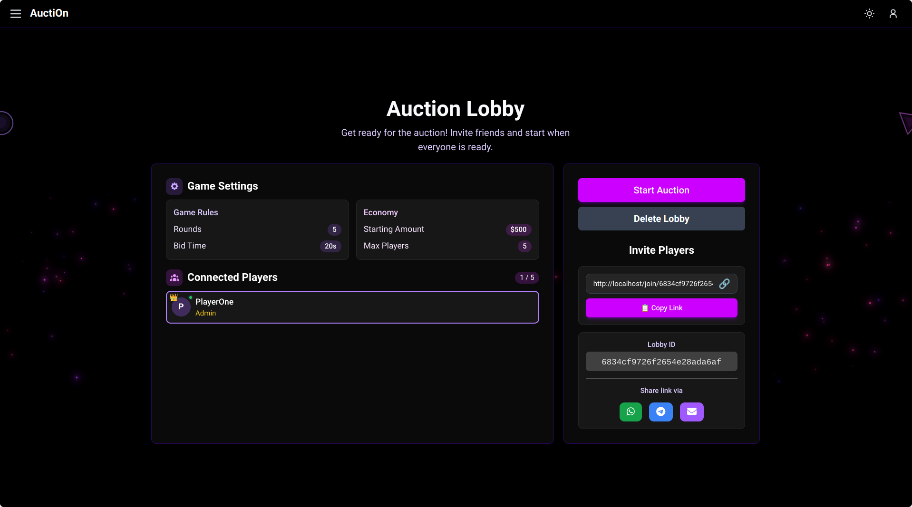
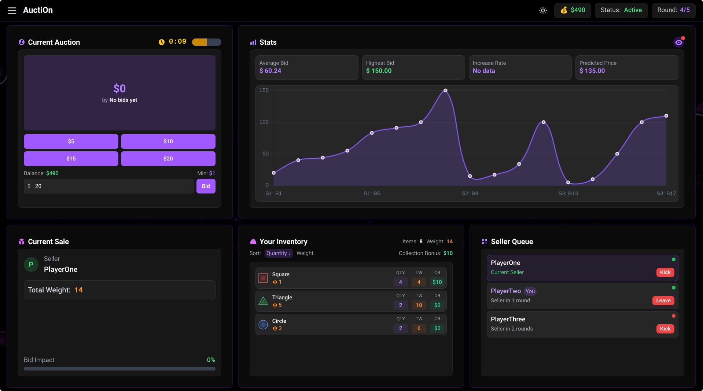

# Usage Examples

This section provides a comprehensive guide on how to use the AuctiOn game application,
covering the main workflows from authentication to gameplay.

## Authentication Workflow

The authentication system allows users to register new accounts and log in to existing ones.
All game features require authentication.

### Registration

Users can create a new account by providing an email, username, and password.

### Login

Returning users can log in with their email and password.

## Lobby Management Workflow

After authentication, users can join existing game lobbies or create their own.

### Creating a New Lobby

Users can create a custom game lobby by setting parameters like maximum players,
game duration, etc.

Once created, the lobby `join link` is displayed, which can be shared with other players.

### Joining a Lobby

Users can join an existing lobby if it has available slots.
To join a lobby, a user can either enter the lobby ID or use a
`join link` provided by the lobby creator.

### Set Ready State

Users can indicate they are ready to start the game by clicking the `Set Ready` button in the lobby.

### Kicking Players

The lobby creator can `kick` players from the lobby if needed.

### Start the Game

Once all players are ready, the lobby creator can start the game.

## Auction Game Workflow

Once all players have joined a lobby and the game starts, players participate in the auction gameplay.

### Selling Items

When it's a player's turn to sell, they can select items from their inventory to put up for auction.
They can also see some **statistics** about the items that he is selling, such as the `predicted price` or
the number of items in the player's inventory after selling the selected items.

### Bidding

When it's not a player's turn to sell, they can place bids on items being auctioned by other players.
Be sure to bid before the auction timer runs out!

## Results and Game End

At the end of the game, players can see the final results, including their total coins and inventory.

## Game Rules Reference

For a complete understanding of the game mechanics, please refer to the [Game Rules](../game-rules) section. 