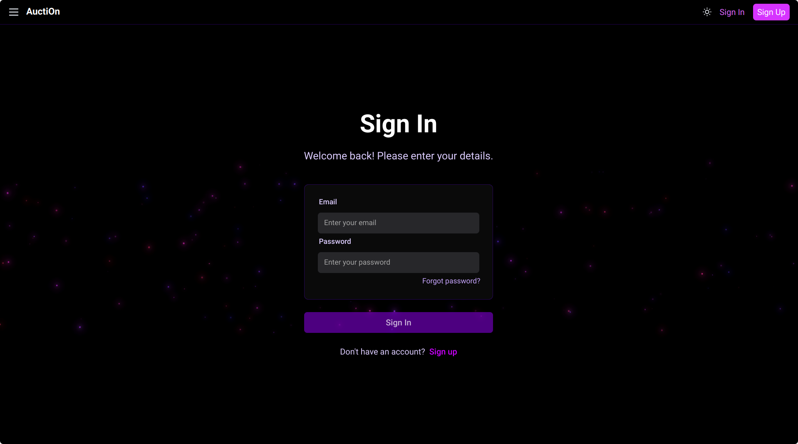
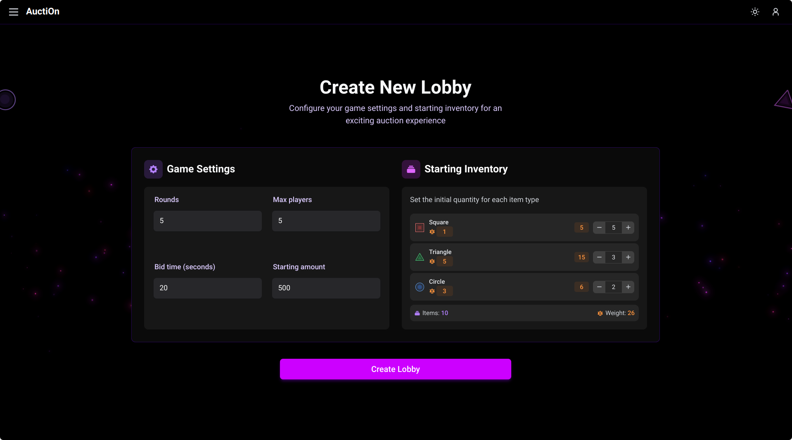

# Usage Examples

This section provides a comprehensive guide on how to use the AuctiOn game application,
covering the main workflows from authentication to gameplay.

## Authentication Workflow

The authentication system allows users to register new accounts and log in to existing ones.
All game features require authentication.

### Registration

Users can create a new account by providing an email, username, and password.


### Login

Returning users can log in with their email and password.



### Authentication API Examples

```bash
# Register a new user
curl -X POST http://localhost:3000/auth/register \
     -H "Content-Type: application/json" \
     -d '{"email": "user@example.com", "name": "player1", "password": "password123"}'

# Login
curl -X POST http://localhost:3000/auth/login \
     -H "Content-Type: application/json" \
     -d '{"email": "user@example.com", "password": "password123"}'
# Response includes JWT token needed for authenticated requests
```

## Lobby Management Workflow

After authentication, users can join existing game lobbies or create their own.

### Creating a New Lobby

Users can create a custom game lobby by setting parameters like maximum players,
game duration, etc.



Once created the lobby join link is displayed, which can be shared with other players.


### Joining a Lobby

Users can join an existing lobby if it has available slots.

**Screenshot: Lobby Details with Join Button**
[Insert screenshot of lobby joining interface]

### Lobby Management API Examples

```bash
# List all available lobbies
curl http://localhost:3000/lobbies \
     -H "Authorization: Bearer <your-jwt-token>"

# Create a new lobby
curl -X POST http://localhost:3000/lobbies \
     -H "Authorization: Bearer <your-jwt-token>" \
     -H "Content-Type: application/json" \
     -d '{"name": "Fun Game", "maxPlayers": 4, "gameMode": "standard"}'

# Join a lobby
curl -X POST http://localhost:3000/lobbies/<lobby-id>/join \
     -H "Authorization: Bearer <your-jwt-token>"

# Start game (lobby owner only)
curl -X POST http://localhost:3000/lobbies/<lobby-id>/start \
     -H "Authorization: Bearer <your-jwt-token>"
```

## Auction Game Workflow

Once all players have joined a lobby and the game starts, players participate in the auction gameplay.

### Lobby Waiting Room

While waiting for other players, users can see who has joined the lobby and chat with them.

**Screenshot: Lobby Waiting Room**
[Insert screenshot of waiting room with player list]

### Game Interface

The main game interface shows the player's inventory, coins, current auction, and bidding controls.

**Screenshot: Main Game Interface**
[Insert screenshot of game interface]

### Selling Items

When it's a player's turn to be the seller, they can select items to sell.

**Screenshot: Seller Interface**
[Insert screenshot of seller selection interface]

### Bidding on Items

When other players are selling, the user can place bids on the offered items.

**Screenshot: Bidding Interface**
[Insert screenshot of bidding interface]

### Game Results

At the end of the game, players can see the final standings and results.

**Screenshot: Game Results Screen**
[Insert screenshot of results screen]

### Real-time Game Interaction (WebSocket)

The game uses WebSockets for real-time communication between players:

```javascript
// Connect to the auction service
const socket = io('http://localhost:3000/auction', {
  auth: { token: 'your-jwt-token' }
});

// Listen for game events
socket.on('connect', () => console.log('Connected to game server!'));
socket.on('auction:start', (data) => console.log('New auction started:', data));
socket.on('auction:bid', (data) => console.log('New bid placed:', data));
socket.on('auction:end', (data) => console.log('Auction ended:', data));
socket.on('game:update', (data) => console.log('Game state updated:', data));
socket.on('game:end', (data) => console.log('Game ended:', data));

// Player actions
// Place a bid
socket.emit('bid', {
  auctionId: 'current-auction-id',
  amount: 25
});

// Sell items (when it's your turn)
socket.emit('sell', {
  items: { circle: 2, triangle: 1, square: 0 }
});
```

## Mobile Responsiveness

The application is designed to work on both desktop and mobile devices.

**Screenshot: Mobile Interface**
[Insert screenshot of mobile interface]

## Game Rules Reference

For a complete understanding of the game mechanics, please refer to the [Game Rules](/game-rules) section. 